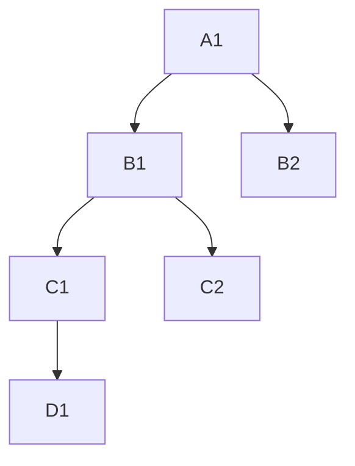
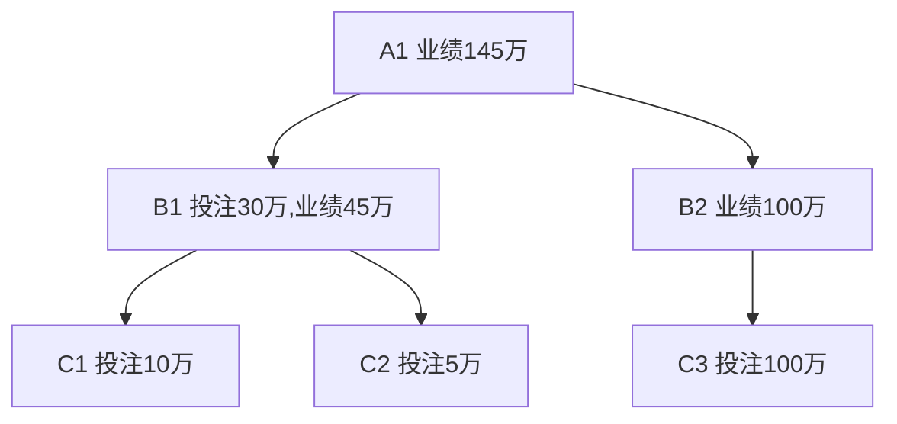
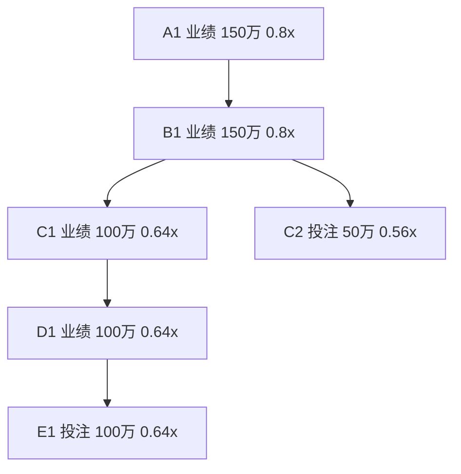
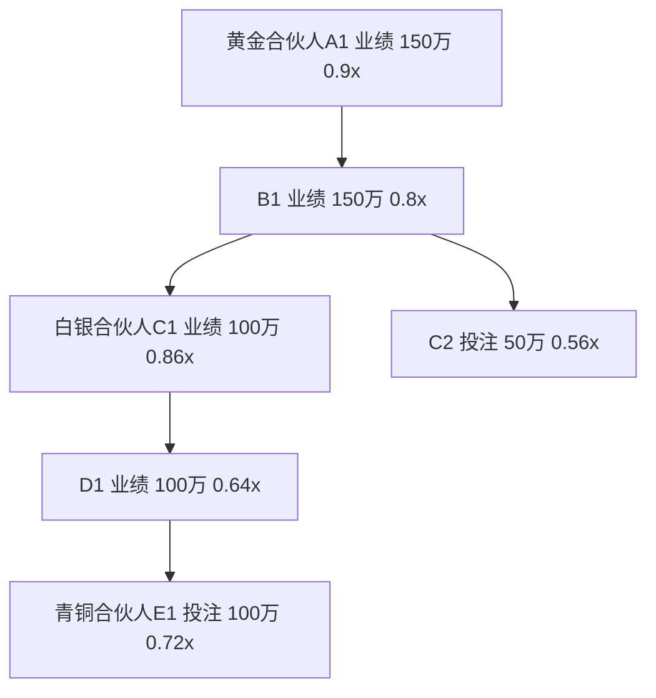
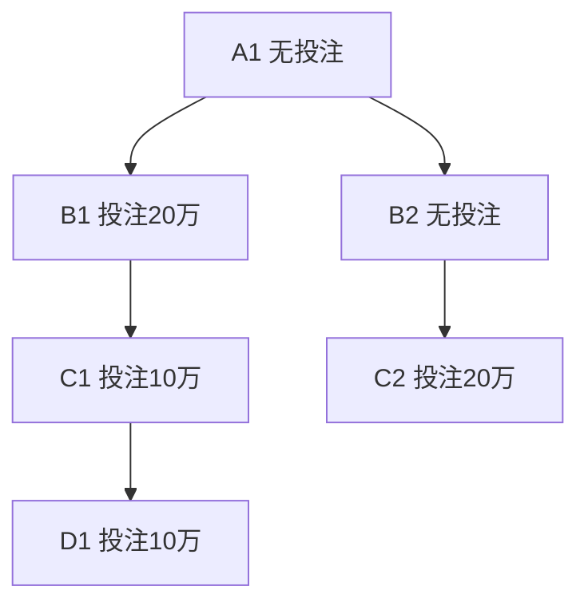
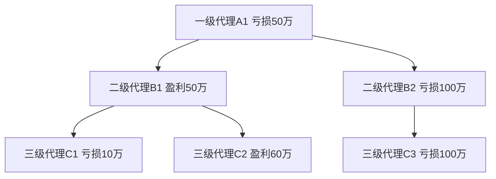
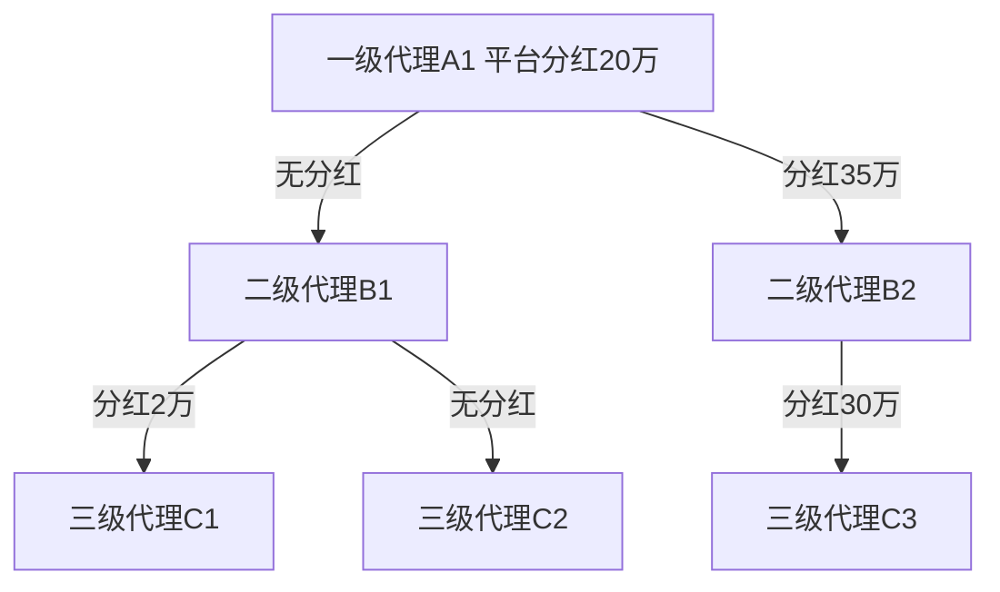
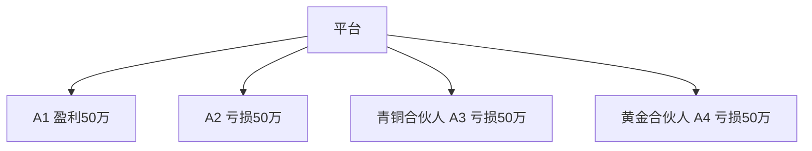

# Game 分润数值模型
## ⼀.【棋牌类/真⼈视讯/真⼈百家乐】日工资 分润数值模型
**日⼯资总资金来源**：玩家总投注量 * 分润比率(x)
**分润比率(x)**：取值不能超过最大利润率，默认值取1%
**结算周期**：每日GMT+8 24:00
**投注业绩**：玩家投注业绩 = 本⼈投注量 + 其⽆限级下线的投注量
**计算公式**：玩家日工资 = 玩家当日本人投注 * 分润比率(x)  * 当日投注业绩对应等级乘数  + 下线投注分配给其所有上线的日工资累加

**下线投注分配给上线的日工资计算公式**：
当级差 n > 1时：
下线投注分配给其级差为 n 的上线的日工资 = 下线当日本人投注 * 分润比率(x) * （级差为 n 的上线当日投注业绩对应等级乘数 - 级差为 n-1 的上线当日投注业绩对应等级乘数）

当级差 n = 1时，上线为该下线的直接上线：
下线投注分配给其直接上线的日工资 = 下线当日本人投注 * 分润比率(x) * （直接上线当日投注业绩对应等级乘数 - 该下线当日投注业绩对应等级乘数）

**级差说明：**

对于玩家 D1 来说，C1与他的级差为1，B1与他的级差为2，A1与他的级差为3。

### 日工资投注业绩对应等级乘数表
| 等级 | 投注业绩（usdt/万） | 等级乘数 | 等级增幅 |
| --- | --- | --- | --- |
| A |0 < 投注量 ≤ 0.15| 0.2x | 0 |
| B | 0.15 < 投注量 ≤ 1.5 | 0.24x | 0.04 |
| C | 1.5 < 投注量 ≤ 7.5 | 0.32x | 0.08 |
| D | 7.5 < 投注量 ≤ 15 | 0.44x | 0.12 |
| E | 15 < 投注量 ≤ 45 | 0.48x | 0.04 |
| F | 45 < 投注量 ≤ 75 | 0.56x | 0.08 |
| G | 75 < 投注量 ≤ 100 | 0.64x | 0.08 |
| H | 100 < 投注量 ≤ 135 | 0.72x | 0.08 |
| I | 135 < 投注量 ≤ 180 | 0.8x | 0.08 |
| J | 180 < 投注量 ≤ 230 | 0.86x | 0.06 |
| K | 230 < 投注量 | 0.9x | 0.04 |

### 举例

| 玩家 | 本人投注（万）  | 业绩（万） | 投注业绩对应等级乘数 |
| --- | --- | --- | --- |
| A1 | 0 | 145 | 0.8 |
| B1 | 30 | 45 | 0.48 |
| B2 | 0 | 100 | 0.64  |
| C1 | 10 | 10 | 0.44 |
| C2 | 5 | 5 | 0.32 |
| C3 | 100 | 100 | 0.64 | 

#### 新算法
- 对于 C1，投注10万，业绩10万，其日工资 = 10w * 1% * 0.44  = _440_
C1分配给 B1 的日工资 = 10w * 1% * （0.48 - 0.44）= 40
C1分配给 A1 的日工资 = 10w * 1% * （0.8 - 0.48）= 320

- 对于 C2，投注5万，业绩5万，其日工资 = 5w * 1% * 0.32 = _160_
C2分配给 B1 的日工资 = 5w * 1% * （0.48 - 0.32）= 80
C2分配给 A1 的日工资 = 5w * 1% * （0.8 - 0.48）= 160
- 对于 C3，投注100万，业绩100万，其日工资 = 100w * 1% * 0.64 = _6400_
C3分配给 B2 的日工资 = 100w * 1% * （0.64 - 0.64）= 0
C3分配给 A1 的日工资 = 100w * 1% * （0.8 - 0.64）= 1600
- 对于 B1，投注30万，业绩45万，其日工资 = B1本人投注日工资 + 所有下线投注分配给B1日工资累加 = 30w * 1% * 0.48 + C1分配给 B1 的日工资 + C2分配给 B1 的日工资 = 1440 + 40 + 80 = _1560_
B1分配给 A1 的日工资 = 30w * 1% * （0.8 - 0.48）= 960

- 对于 B2，投注0万，业绩100万，其日工资 = B2本人投注日工资 + 所有下线投注分配给B2日工资累加 = _0_
- 对于 A1，投注0万，业绩145万，其日工资 = A1本人投注日工资 + 所有下线投注分配给A1日工资累加 = 0 + C1分配给 A1 的日工资 + C2分配给 A1 的日工资 + C3分配给 A1 的日工资 + B1分配给A1的日工资 = 320 + 160 + 1600 + 960 = _3040_

| 玩家 | A1 | B1 | B2 | C1 | C2 | C3 | 最终日工资 |
| --- | --- | --- | --- | --- | --- | --- | --- |
| 分配给A1日工资 | 0 | 960 | 0 | 320 | 160 | 1600 | 3040 |
| 分配给B1日工资 | - | 1400 | - | 40 | 80 | - | 1560 |
| 分配给B2日工资 | - | - | 0 | - | - | 0 | 0 |
| 分配给C1日工资 | - | - | - | 440 | - | - | 440 |
| 分配给C2日工资 | - | - | - | - | 160 | - | 160 |
| 分配给C3日工资 | - | - | - | - | - | 6400 | 6400 |

#### 旧算法：
- 对于 C1，业绩10万，对应等级 D，日工资 = 10w * 1% * 0.44  = _440_
- 对于 C2，业绩5万，对应等级 C，日工资 = 5w * 1% * 0.32 = _160_
- 对于 C3，业绩100万，对应等级 G，日工资 = 100w * 1% * 0.64 = _6400_
- 对于 B1，业绩45万，对应等级 E，日工资 = 45w * 1% * 0.48 - 440 - 160 = _1560_
- 对于 B2，业绩100万，对应等级 G，日工资 = 100w * 1% * 0.64 - 6400 = _0_
- 对于 A1，业绩 145万，对应等级 I，**日工资 = 145w * 1% * 0.8 - 45w * 1% * 0.48 - 100w * 1% * 0.64 = 3040**

| 玩家 | 日工资 |
| --- | --- |
| A1 | 3040 |
| B1 | 1560 |
| B2 | 0 |
| C1 | 440 |
| C2 | 160 |
| C3 | 6400 |

### 保底白名单
平台可以把玩家添加到保底白名单里，让玩家享受更高的等级乘数。

保底白名单支持不同的档位，比如青铜合伙人，白银合伙人，黄金合伙人等。每个档位对应一个等级乘数。

玩家添加到指定档位的白名单后，如果按照其投注业绩的等级乘数小于该白名单档位的等级乘数，那么在计算该玩家的日工资时，采用白名单档位的等级乘数。反之，则延用投注业绩的等级乘数。

如果上线的等级乘数小于下线的等级乘数，那么下线投注分配给该上线的日工资为0，并且在计算下线投注分配给上线的日工资时，跳过该上线的等级乘数，采用实际有参与分配的下线等级乘数。（参见下面的例子）

下线投注分配给某上线的日工资 = 下线当日本人投注 * 分润比率(x) * （某上线的实际等级乘数 - 实际等级乘数低于该上线的最近下线的实际等级乘数）

#### 白名单例子
| 档位 | 等级乘数 | 
| --- | --- | 
| 青铜合伙人 | 0.72x |
| 白银合伙人 | 0.86x |
| 黄金合伙人 | 0.9x |

| 玩家 | 投注量 | 投注业绩 | 投注业绩等级乘数 | 白名单等级乘数 | 实际等级乘数 | 
| --- | --- | --- | --- | --- | --- |
| A1 | - | 150万 | 0.8x | 0.9x | 0.9x |
| B1 | - | 150万 | 0.8x | - | 0.8x |
| C1 | - | 100万 | 0.64x | 0.86x | 0.86x |
| C2 | 30万 | 50万 | 0.56x | - | 0.56x |
| D1 | - | 100万 | 0.64x | - | 0.64x |
| E1 | 100万 | 100万 | 0.64x | - | 0.72x |

- 对于 E1，投注100万，其日工资 = 100w * 1% * 0.72  = _7200_
E1分配给 D1 的日工资 = 0（因D1的等级乘数小于E1）
E1分配给 C1 的日工资 = 100w * 1% * （0.86 - 0.72）= 1400
E1分配给 B1 的日工资 = 0（因D1的等级乘数小于E1）
E1分配给 A1 的日工资 = 100w * 1% * （0.9 - 0.86）= 400

- 对于 C2，投注50万，其日工资 = 50w * 1% * 0.56 = __2800__
C2分配给 B1 的日工资 = 50w * 1% * （0.8 - 0.56）= 1200
C2分配给 A1 的日工资 = 50w * 1% * （0.9 - 0.8）= 500

| 玩家 | A1 | B1 | C1 | C2 | D1 | E1 | 最终日工资 |
| --- | --- | --- | --- | --- | --- | --- | --- |
| 分配给A1日工资 | - | - | - | 500 | - | 400 | 900 |
| 分配给B1日工资 | - | - | - | 1200 | - | 0 | 1200 |
| 分配给C1日工资 | - | - | - | - | - | 1400 | 1400 |
| 分配给C2日工资 | - | - | - | 2800 | - | - | 2800 |
| 分配给D1日工资 | - | - | - | - | - | 0 | 0 |
| 分配给E1日工资 | - | - | - | - | - | 7200 | 7200 |

## 二.【彩票 + 电子竞技类】日工资 分润数值模型
**⽇工资总资金来源**：玩家总投注量 * 分润比率(x)
**分润比率(x)**：默认值取 1%
**结算周期**：每日GMT+8 24:00
**计算公式**：玩家日工资 = 玩家本人当日投注产生的日工资 + 其所有下线当日投注分配给其的日工资累加
**玩家本人当日投注产生的日工资** = 玩家本人当日投注量 * 分润比率(x) * 分配给本人的比率(y)
**分配给本人的比率(y)**：取值 0.5
**下线分配给上线的日工资** 分为两种情况：
(1) 如果上线不为一级代理，则
下线分配给上线的日工资 = 下线本人投注量 * 分润比率(x) * (1 - y) * 级差乘数
(2) 如果上线为一级代理，则
下线分配给上线的日工资 = 下线本人投注量 * 分润比率(x) * (1 - y)  - 下线分配给其上线的日工资累加
**级差乘数**：60% * 40% ^ (级差-1)

### 日工资级差乘数表
| 上线级差 | 级差乘数公式 | 级差乘数 |
| --- | --- | --- |
| 1 | 60% * 40% ^ 0 | 0.6 |
| 2 | 60% * 40% ^ 1  | 0.24 |
| 3 | 60% * 40% ^ 2 | 0.096 |
| 4 | 60% * 40% ^ 3 | 0.0384 |
| 5 | 60% * 40% ^ 4 | 0.01536 |
| 6 | 60% * 40% ^ 5 | 0.006144 |
| ... |  |  |
| n | 60% * 40% ^ (n-1) |  |

### 举例

- 对于 D1，投注10万，其日工资 = 10w * 1% * 0.5  = 500
D1分配给 C1 的日工资 = 10w * 1% * （1-0.5）*（60% * 40% ^ 0）= 300
D1分配给 B1 的日工资 = 10w * 1% * （1-0.5）*（60% * 40% ^ 1）= 120
D1分配给 A1 的日工资 = 10w * 1% * （1-0.5）- 300 - 120 = 80

- 对于 C1，投注10万，日工资 = C1本人投注产生的日工资 + D1 分配给C1的日工资 = 10w * 1% * 0.5 + 300 = 500 + 300 = 800
C1分配给 B1 的日工资 = 10w * 1% * （1-0.5）*（60% * 40% ^ 0）= 300
C1分配给 A1 的日工资 = 10w * 1% * （1-0.5）- 300 = 200

- 对于 C2，投注20万，日工资 = 20w * 1% * 0.5  = 1000
C2分配给 B2 的日工资 = 20w * 1% * （1-0.5）*（60% * 40% ^ 0）= 600
C2分配给 A1 的日工资 = 20w * 1% * （1-0.5）- 300 = 400

- 对于 B1，投注20万，日工资 = B1本人投注产生的日工资 + C1 分配给B1的日工资 + D1分配给B1的日工资 = 20w * 1% * 0.5 + 300 + 120 = 1000 + 300 + 120  = 1420
B1分配给 A1 的日工资 = 20w * 1% * （1-0.5） = 1000

- 对于 B2，无投注，日工资 = C2 分配给B2的日工资 = 600
- 对于 A1，无投注，日工资 = B1 分配给 A1的日工资 + C1分配给 A1的日工资 + C2分配给A1的日工资 + D1分配给A1的日工资 =  1000 + 200 + 400 + 80 =1680

| 玩家 | A1 | B1 | B2 | C1 | C2 | D1 | 最终日工资 |
| --- | --- | --- | --- | --- | --- | --- | --- |
| 分配给A1日工资 | - | 1000 | - | 200 | 400 | 80 | 1680 |
| 分配给B1日工资 | - | 1000 | - | 300 | - | 120 | 1420 |
| 分配给B2日工资 | - | - | - | - | 600 | - | 600 |
| 分配给C1日工资 | - | - | - | 500 | - | 300 | 800 |
| 分配给C2日工资 | - | - | - | - | 1000 | - | 1000 |
| 分配给D1日工资 | - | - | - | - | - | 500 | 500 |

## 三.【彩票 + 电子竞技类】亏损分红
当**平台方**在一个结算周期内将对该结算周期里处于亏损的**一级代理商**进⾏分红；**一级代理商**对归属于其的亏损**二级代理商**进⾏分红；**二级代理商**对归属于其的亏损**三级代理商**进⾏行分红。亏损分红只到**三级代理商**，**三级代理商**以下， 将不享受亏损分红。

亏损分红级数：三级
触发条件：
平台⽅/一级/二级代理商: 其下级代理商该结算周期为亏损状态时触发；其下级代理商该结算周期为盈利状态时则不触发。
结算周期：月度
结算⽇：每月最后一个自然⽇ GMT+8 24:00

### 平台给一级代理亏损分红比例表

| 亏损（万） | 活跃人数 | 分红比例 |
| --- | --- | --- |
| 0.2 < 亏损额 ≤ 1.5 | 0 | 25% |
| 1.5 < 亏损额 ≤ 5 | 5 | 30% |
| 5 < 亏损额 ≤ 15 | 10 | 35% |
| 15 < 亏损额 ≤ 60 | 15 | 40% |
| 60 < 亏损额 ≤ 150 | 20 | 45% |
| 150 < 亏损额 | 30 | 50% |

### 一级代理给二级代理亏损分红比例表

| 亏损（万） | 活跃人数 | 分红比例 |
| --- | --- | --- |
| 0.2 < 亏损额 ≤ 1.2 | 0 | 15% |
| 1.2 < 亏损额 ≤ 4 | 5 | 20% |
| 4 < 亏损额 ≤ 12 | 10 | 25% |
| 12 < 亏损额 ≤ 45 | 15 | 30% |
| 45 < 亏损额 ≤ 100 | 20 | 35% |
| 100 < 亏损额 | 30 | 40% |

### 二级代理给三级代理亏损分红比例表

| 亏损（万） | 活跃人数 | 分红比例 |
| --- | --- | --- |
| 0.2 < 亏损额 ≤ 1 | 0 | 5% |
| 1 < 亏损额 ≤ 3 | 5 | 10% |
| 3 < 亏损额 ≤ 8 | 10 | 15% |
| 8 < 亏损额 ≤ 30 | 15 | 20% |
| 30 < 亏损额 ≤ 60 | 20 | 25% |
| 60 < 亏损额 | 30 | 30% |

### 活跃人数定义
该周期内累计
1.登录且进行游戏天数 > 7天 且 有效投注量 > 200 USDT 
或
2.有效投注量 > 3000 USDT

### 举例

- 对于三级代理C1，亏损10万，二级代理B1给他的分红为 10w * 20% = 20000
- 对于三级代理C2，盈利60万，无分红
- 对于三级代理C3，亏损100万，二级代理B2给他的分红为 100w * 30% = 300000
- 对于二级代理B1，盈利50万，无分红
- 对于二级代理B2，亏损100万，一级代理A1给他的分红为 100w * 35% = 350000
- 对于一级代理A1，亏损50万，平台给他的分红为 50w * 40% = 200000

**代理分红情况表**

| 代理 | 盈亏 | 分红 |
| --- | --- | --- |
| A1 | -50万 | 20万 |
| B1 | +50万 | 0 |
| B2 | -100万 | 35万 |
| C1 | -10万 | 2万 |
| C2 | +50万 | 0 |
| C3 | -100万 | 30万 |

从上图可见二级代理B1倒贴分红2万。以及一级代理A1倒贴分红 15万（35万-20万）。

## 一级代理保底白名单
平台可以把一级代理添加到指定的保底白名单里，让一级代理享受分红比例。

保底白名单支持不同的档位，比如青铜合伙人，白银合伙人，黄金合伙人等。每个档位对应一个分红比例。

一级代理添加到指定档位的白名单后，如果其正常的分红比例小于该白名单档位的分红比例，那么在计算该代理的分红时，采用白名单档位的分红比例。反之，则延用他正常的分红比例。

#### 白名单例子
| 档位 | 等级比率 | 
| --- | --- | 
| 青铜合伙人 | 30% |
| 白银合伙人 | 40% |
| 黄金合伙人 | 50% |

- 对于A1，盈利50万，不分红
- 对于A2，亏损50万，正常分红比率 40%，分红额 = 50万 * 40% = 20万
- 对于A3，亏损50万，正常分红比率 40%，白名单分红比率 30%，实际分红比率取 40%，分红额 = 50万 * 40% = 20万
- 对于A4，亏损50万，正常分红比率 40%，白名单分红比率 50%，实际分红比率取 50%，分红额 = 50万 * 50% = 25万

| 玩家 | 盈亏情况 | 正常分红比率 | 白名单分红比率 | 实际分红比率 | 分红 |
| ---  | --- | --- | --- | --- | --- |
| A1 | 盈利50万 | 0 | - | 0 | 0 |
| A2 | 亏损50万 | 40% | - | 40% | 20万 |
| A3 | 亏损50万 | 40% | 30% | 40% | 20万 |
| A4 | 亏损50万 | 40% | 50% | 50% | 25万 |
