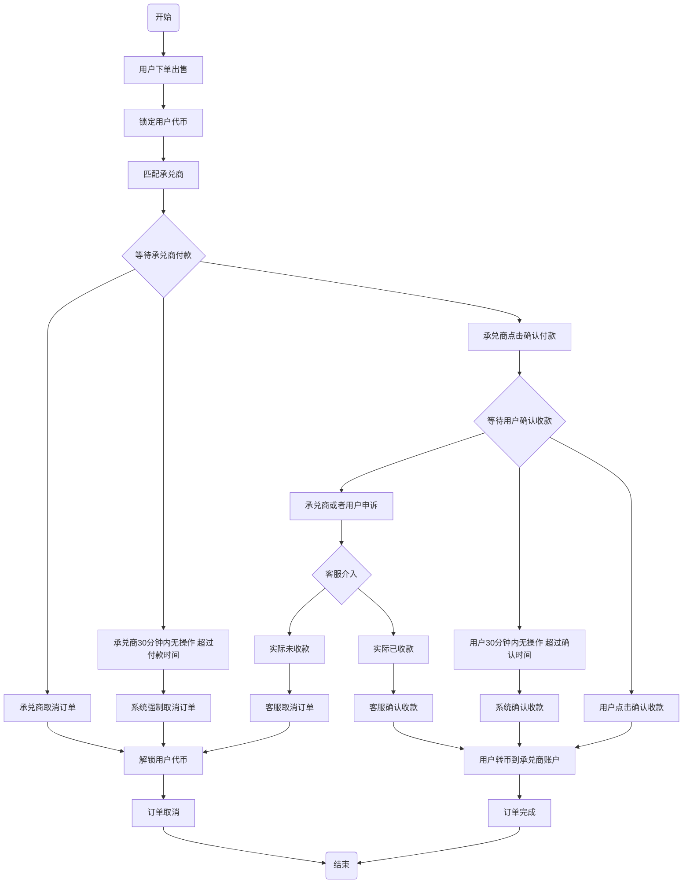

## EUSD 出售流程

```mermaid
graph TB
    start(开始) --> buy[用户下单出售]
    buy --> lock[锁定用户代币]
    lock --> match[匹配承兑商]
    match --> waitExchangerPay{等待承兑商付款}
    waitExchangerPay --> exchangerCancel[承兑商取消订单]
    exchangerCancel --> unlock[解锁用户代币]
    unlock --> canceled[订单取消]
    waitExchangerPay --> exchangerExpired[承兑商30分钟内无操作 超过付款时间]
    waitExchangerPay --> exchangerConfirm[承兑商点击确认付款]
    exchangerExpired --> systemCancel[系统强制取消订单]
    systemCancel --> unlock
    exchangerConfirm --> waitUserConfirm{等待用户确认收款}
    waitUserConfirm --> appeal[承兑商或者用户申诉]
    waitUserConfirm --> userExpired[用户30分钟内无操作 超过确认时间]
    waitUserConfirm --> userConfirm[用户点击确认收款]
    userExpired --> systemConfirm[系统确认收款]
    userConfirm --> transfer[用户转币到承兑商账户]
    systemConfirm --> transfer
    transfer --> finished[订单完成]
    appeal --> adminProcess{客服介入}
    adminProcess --> unarrived[实际未收款]
    adminProcess --> arrived[实际已收款]
    arrived --> adminConfirm[客服确认收款]
    adminConfirm --> transfer
    unarrived --> adminCancel[客服取消订单]
    adminCancel --> unlock
    canceled --> stop(结束)
    finished --> stop
```