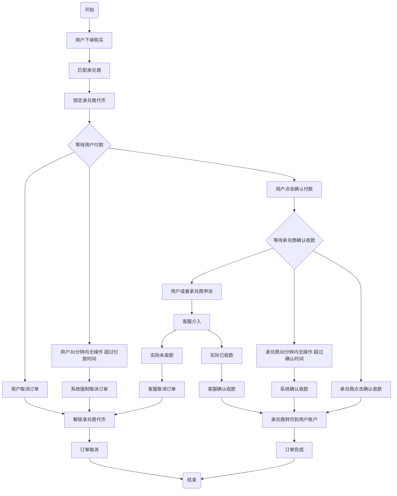

## EUSD 购买流程

```mermaid
graph TB
    start(开始) --> buy[用户下单购买]
    buy --> match[匹配承兑商]
    match --> lock[锁定承兑商代币]
    lock --> waitUserPay{等待用户付款}
    waitUserPay --> userCancel[用户取消订单]
    userCancel --> unlock[解锁承兑商代币]
    unlock --> canceled[订单取消]
    waitUserPay --> userExpired[用户30分钟内无操作 超过付款时间]
    waitUserPay --> userConfirm[用户点击确认付款]
    userExpired --> systemCancel[系统强制取消订单]
    systemCancel --> unlock
    userConfirm --> waitExchangerConfirm{等待承兑商确认收款}
    waitExchangerConfirm --> appeal[用户或者承兑商申诉]
    waitExchangerConfirm --> exchangerExpired[承兑商30分钟内无操作 超过确认时间]
    waitExchangerConfirm --> exchangerConfirm[承兑商点击确认收款]
    exchangerExpired --> systemConfirm[系统确认收款]
    exchangerConfirm --> transfer[承兑商转币到用户账户]
    systemConfirm --> transfer
    transfer --> finished[订单完成]
    appeal --> adminProcess[客服介入]
    adminProcess --> unarrived[实际未收款]
    adminProcess --> arrived[实际已收款]
    arrived --> adminConfirm[客服确认收款]
    adminConfirm --> transfer
    unarrived --> adminCancel[客服取消订单]
    adminCancel --> unlock
    canceled --> stop(结束)
    finished --> stop
```