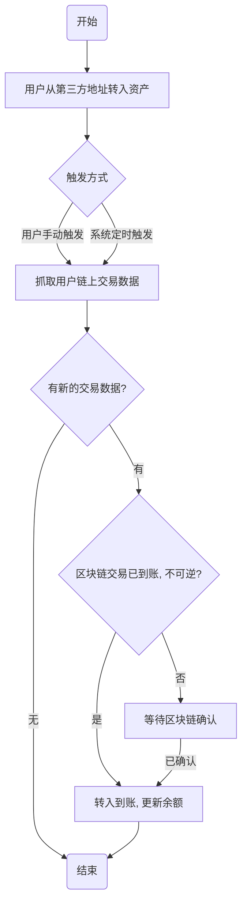
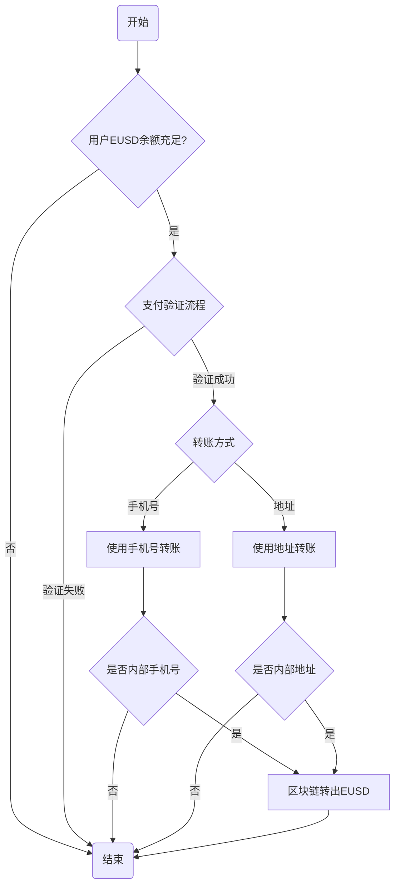

## EUSD 转入资产

```mermaid
graph TB
    start(开始) --> transfer[用户从第三方地址转入资产]
    transfer --> trigger{触发方式}
    trigger -- 用户手动触发 --> fetch[抓取用户链上交易数据]
    trigger -- 系统定时触发 --> fetch
    fetch --> hasNew{有新的交易数据?}
    hasNew -- 有 --> checkConfirmed{区块链交易已到账, 不可逆?}
    hasNew -- 无 --> stop(结束)
    checkConfirmed -- 是 --> confirmed[转入到账, 更新余额]
    checkConfirmed -- 否 --> pending[等待区块链确认]
    pending -- 已确认 --> confirmed
    confirmed --> stop(结束)
```

## EUSD 转出资产

```mermaid
graph TB
    start(开始) --> checkBalance{用户EUSD余额充足?}
    checkBalance -- 是 --> checkPay{支付验证流程}
    checkBalance -- 否 --> stop(结束)
    checkPay -- 验证成功 --> type{转账方式}
    checkPay -- 验证失败 --> stop
    type -- 手机号 --> phone[使用手机号转账]
    type -- 地址 --> address[使用地址转账]
    phone --> checkPhone{是否内部手机号}
    address --> checkAddress{是否内部地址}
    checkPhone -- 是 --> transfer[区块链转出EUSD]
    checkPhone -- 否 --> stop(结束)
    checkAddress -- 是 --> transfer
    checkAddress -- 否 --> stop(结束)
    transfer --> stop
```