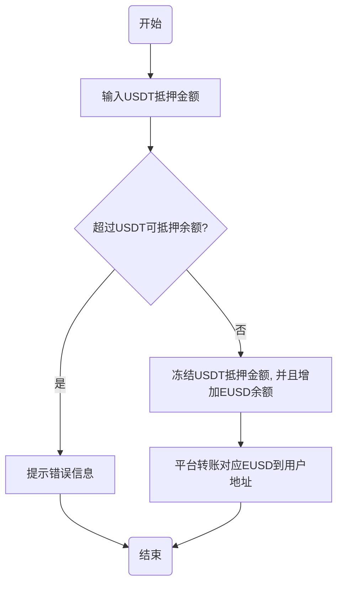
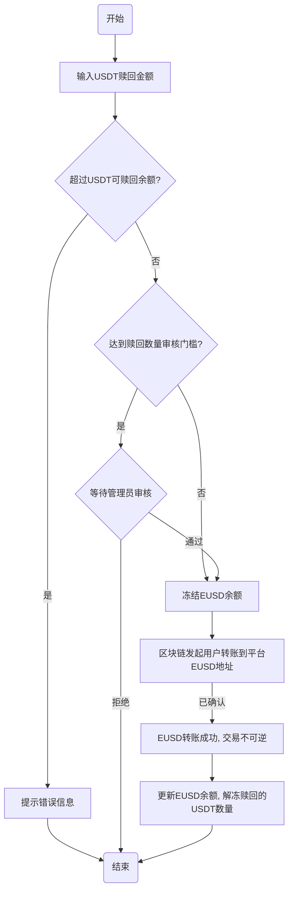

## 抵押USDT

```mermaid
graph TB
    start(开始) --> input[输入USDT抵押金额]
    input --> checkBalance{超过USDT可抵押余额?}
    checkBalance -- 是 --> invalidAmountError[提示错误信息]
    invalidAmountError --> stop(结束)
    checkBalance -- 否 --> mortgage[冻结USDT抵押金额, 并且增加EUSD余额]
    mortgage --> transfer[平台转账对应EUSD到用户地址]
    transfer --> stop
```

## 赎回USDT

```mermaid
graph TB
    start(开始) --> input[输入USDT赎回金额]
    input --> checkBalance{超过USDT可赎回余额?}
    checkBalance -- 是 --> invalidAmountError[提示错误信息]
    invalidAmountError --> stop(结束)
    checkBalance -- 否 --> checkLimit{达到赎回数量审核门槛?}
    checkLimit -- 是 --> examine{等待管理员审核}
    checkLimit -- 否 --> freeze[冻结EUSD余额]
    examine -- 通过 --> freeze
    examine -- 拒绝 --> stop
    freeze --> transfer[区块链发起用户转账到平台EUSD地址]
    transfer -- 已确认 --> confirmed[EUSD转账成功, 交易不可逆]
    confirmed --> release[更新EUSD余额, 解冻赎回的USDT数量]
    release --> stop
```
