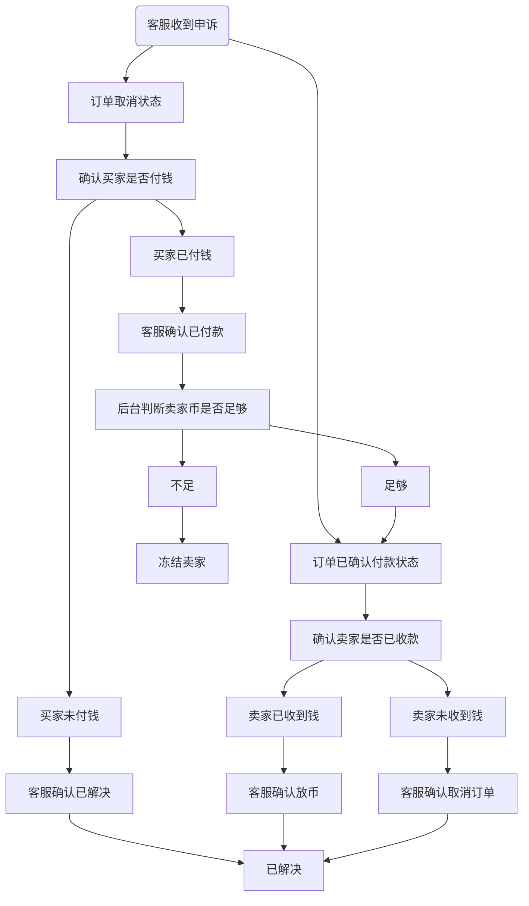

## 后台申诉处理流程

```mermaid
graph TB
    start(客服收到申诉) --> ordercancel[订单取消状态]
    start(客服收到申诉) --> orderpay[订单已确认付款状态]
    ordercancel --> ispay[确认买家是否付钱]
    ispay --> unpay[买家未付钱]
    unpay --> confirmresolve[客服确认已解决]
    confirmresolve --> resolve[已解决]
    ispay --> payed[买家已付钱]
    payed --> confirmpay[客服确认已付款]
    confirmpay --> dealconfirmpay[后台判断卖家币是否足够]
    dealconfirmpay --> enough[足够]
    enough --> orderpay
    orderpay --> isrev[确认卖家是否已收款]
    isrev --> reved[卖家已收到钱]
    reved --> confirmorder[客服确认放币]
    confirmorder --> resolve
    isrev --> unrev[卖家未收到钱]
    unrev --> confirmcancelorder[客服确认取消订单]
    confirmcancelorder --> resolve
    dealconfirmpay --> unenough[不足]
    unenough --> freeze[冻结卖家]
```