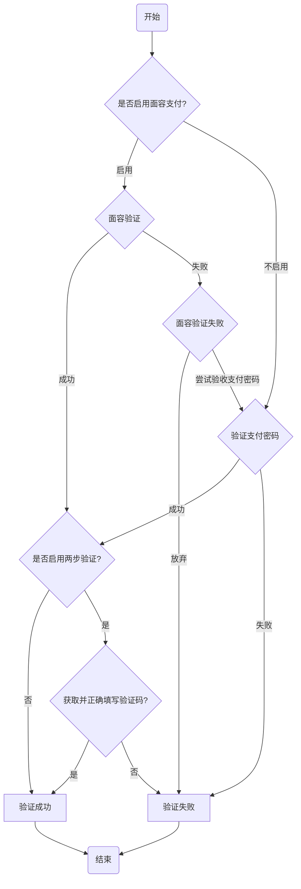

## 支付验证流程

```mermaid
graph TB
    start(开始) --> checkFaceIdEnabled{是否启用面容支付?}
    checkFaceIdEnabled -- 启用 --> checkFaceId{面容验证}
    checkFaceId -- 成功 --> check2step{是否启用两步验证?}
    checkFaceId -- 失败 --> faceIdFail{面容验证失败}
    faceIdFail -- 放弃 --> fail[验证失败]
    faceIdFail -- 尝试验收支付密码 --> checkPayPassword{验证支付密码}
    checkFaceIdEnabled -- 不启用 --> checkPayPassword
    checkPayPassword -- 成功 --> check2step{是否启用两步验证?}
    checkPayPassword -- 失败 --> fail
    check2step -- 否 --> sucess[确认收款成功]
    check2step -- 是 --> checkSmscode{获取并正确填写验证码?}
    checkSmscode -- 是 --> sucess[验证成功]
    checkSmscode -- 否 --> fail
    sucess --> stop(结束)
    fail --> stop
```