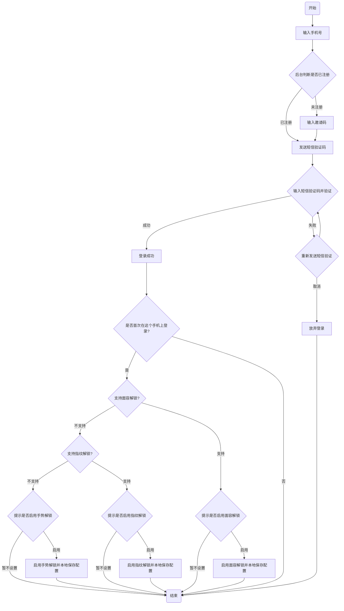

# 登录注册流程

```mermaid
graph TB
    start(开始) --> inputPhone[输入手机号]
    inputPhone --> checkRegistered{后台判断是否已注册}
    checkRegistered -- 已注册 --> sendSmsCode[发送短信验证码]
    checkRegistered -- 未注册 --> inputInvite[输入邀请码]
    inputInvite --> sendSmsCode
    sendSmsCode --> checkSmsCode{输入短信验证码并验证}
    checkSmsCode -- 成功 --> sucess[登录成功]
    checkSmsCode -- 失败 --> reSendSmsCode{重新发送短信验证}
    reSendSmsCode --> checkSmsCode
    reSendSmsCode -- 取消 --> fail[放弃登录]
    sucess --> checkMobileFirst{是否首次在这个手机上登录?}
    checkMobileFirst -- 是 --> checkSupportFaceId{支持面容解锁?}
    checkSupportFaceId -- 支持 --> popEnableFaceId{提示是否启用面容解锁}
    checkSupportFaceId -- 不支持 --> checkSupportFingerprint{支持指纹解锁?}
    checkSupportFingerprint -- 支持 --> popEnableFingerprint{提示是否启用指纹解锁}
    checkSupportFingerprint -- 不支持 --> popEnableGesture{提示是否启用手势解锁}
    popEnableGesture -- 启用 --> enableGesture[启用手势解锁并本地保存配置]
    popEnableGesture -- 暂不设置 --> stop
    enableGesture --> stop
    popEnableFingerprint -- 启用 --> enableFingerprint[启用指纹解锁并本地保存配置]
    popEnableFingerprint -- 暂不设置 --> stop
    enableFingerprint --> stop
    popEnableFaceId -- 暂不设置 --> stop
    popEnableFaceId -- 启用 --> enableFaceId[启用面容解锁并本地保存配置]
    enableFaceId --> stop(结束)
    checkMobileFirst -- 否 --> stop
    fail --> stop 
```