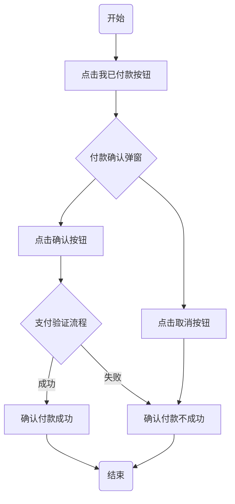

## 确认付款流程

```mermaid
graph TB
    start(开始) --> clickButton[点击我已付款按钮]
    clickButton --> confirm{付款确认弹窗}
    confirm --> confirmYes[点击确认按钮]
    confirm --> confirmNo[点击取消按钮]
    confirmNo --> fail[确认付款不成功]
    confirmYes --> checkPay{支付验证流程}
    checkPay -- 成功 --> sucess[确认付款成功]
    checkPay -- 失败 --> fail
    sucess --> stop(结束)
    fail --> stop
```