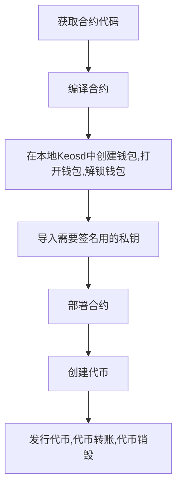

**cleos（cli + eos = cleos）-与区块链交互并管理钱包的命令行界面**  
与EOS的测试节点，或正式节点互动，利用cleos模块  



**参考**
```
http://jungle2.cryptolions.io:80   测试网

winpaytoken2  

owner := "EOS5KDSjroTpdPWHsK3cmtHVKc1GUyTwTgMtHQ6ZuiGjXu8Qqke8p"  5K9RHHfGGqSGVWGuH3oYZgrvF3MY83fhhK5tN4ESKeQPWqAtJcn  

active := "EOS5KDSjroTpdPWHsK3cmtHVKc1GUyTwTgMtHQ6ZuiGjXu8Qqke8p"  5K9RHHfGGqSGVWGuH3oYZgrvF3MY83fhhK5tN4ESKeQPWqAtJcn

cleos --url http://jungle2.cryptolions.io:80 wallet create --name ihyf_wallet --to-console

PW5J5TWkXNRc1wknGRHz5ujHjPNofjvFhgg2sLJKZvpn5Y4f4LSuF"

cleos --url http://jungle2.cryptolions.io:80 wallet open -n ihyf_wallet

cleos --url http://jungle2.cryptolions.io:80 wallet import --private-key 5K9RHHfGGqSGVWGuH3oYZgrvF3MY83fhhK5tN4ESKeQPWqAtJcn -n ihyf_wallet

cleos --url http://jungle2.cryptolions.io:80 wallet import --private-key 5K9RHHfGGqSGVWGuH3oYZgrvF3MY83fhhK5tN4ESKeQPWqAtJcn -n ihyf_wallet

cleos --url http://jungle2.cryptolions.io:80 get account winpaytoken2
部署合约:
cleos --url http://jungle2.cryptolions.io:80 set contract winpaytoken2 /root/contracts/winpay.token --abi 

winpay.token.abi -p winpaytoken2@active

发行最大量十亿token
cleos --url http://jungle2.cryptolions.io:80 push action winpaytoken2 create '[ "winpaytoken2", "1000000000.0000 EUSD"]' -p winpaytoken2@active

发行1000w
cleos --url http://jungle2.cryptolions.io:80 push action winpaytoken2 issue '["winpaytoken2", "10000000.0000 EUSD", "memo"]' -p winpaytoken2@active

销毁
cleos --url http://88.99.193.44:8888 push action winpaytoken2 retire '["900000000.0000 EUSD", "memo"]' -p winpaytoken2@active
```