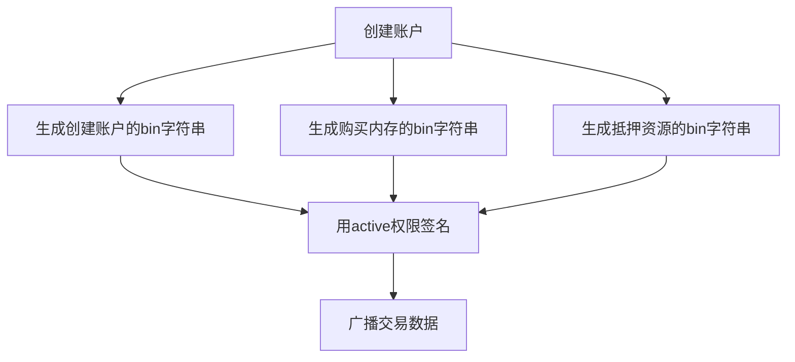
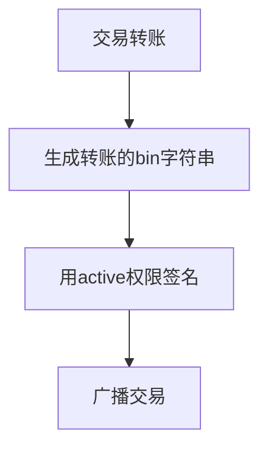

****EOS链上交易，主要用EOS-Go SDK 并在此基础上封装****

其中可分为利用Keosd节点签名，和KeyBag签名 两种方式

Keosd节点允许本地访问，或内网访问，签名前 需要在keosd导入私钥

KeyBag签名，需要在初始化时 导入私钥

```go
a.keyBag = &eos.KeyBag{}
err = a.keyBag.ImportPrivateKey(EosConfig.ActivePrivateKey)
```
**1.创建新账户**

**2.转账**

**购买资源，回收资源等流程类似，都是先序列化josn数据，然后签名，最后广播;**   

**获取节点数据，获取余额等流程相对简单，直接请求节点就可以了;**
