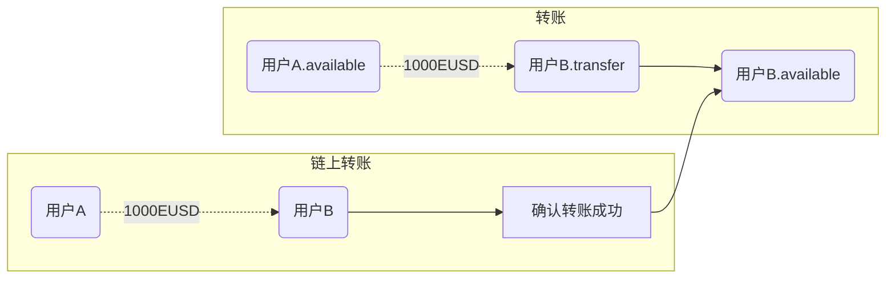
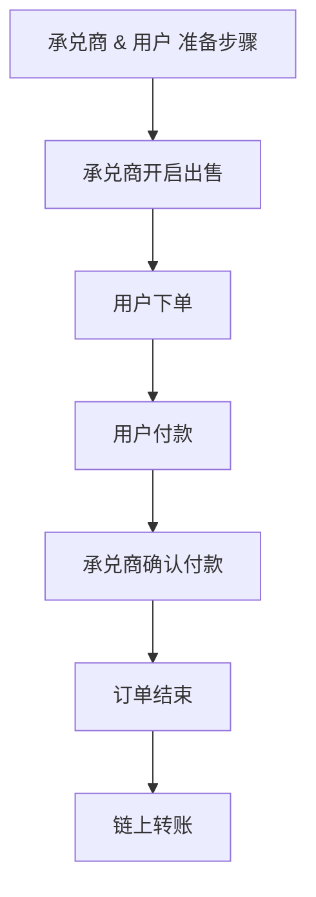
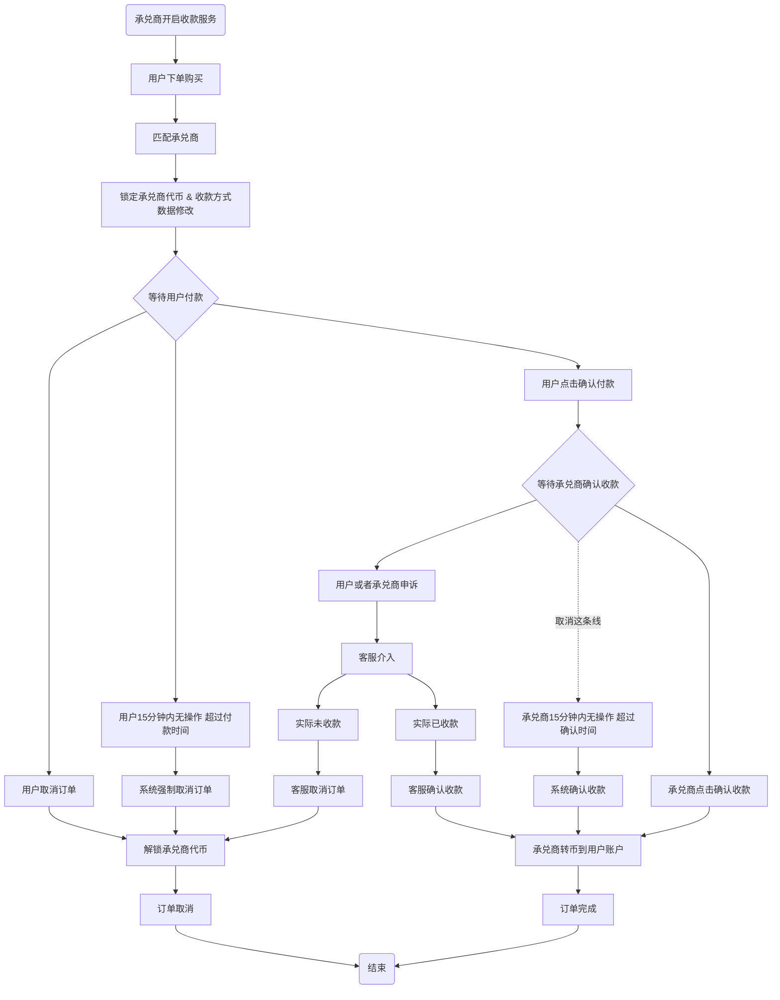
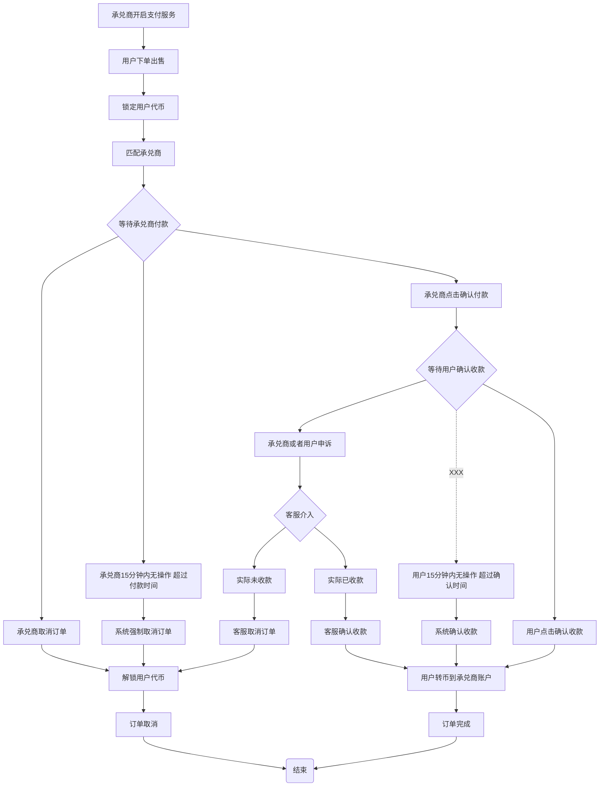

# 用户资产设计
available 可用资产
trade 交易冻结资产，出售时冻结
game 游戏冻结资产
transfer 转入中资产，已经买入或者转入但链上未确认资产
transfer_game 转入中资产但带入游戏中冻结

# 承兑商资产设计
available 可用资产
trade 交易冻结

## 资产变更
- OTC内部是实时划转
- 
- 链上转账由定时任务不断轮询处理

# OTC 交易
- OTC购买 （用户购买、承兑商出售）
- OTC出售  (用户出售、承兑商购买)

# OTC购买
### 步骤
1. 承兑商开启收款服务（挂单）
2. 用户选择支付方式&下单 - 撮合交易
3. 用户标记付款（用户付款-线下操作）
4. 承兑商确认收款（承兑商-确认）
5. 链上转账
6. 转账确认
7. 订单实际完成
8. 用户取消订单
9. 15分钟自动取消订单
10. 申诉
11. 申诉-取消订单
12. 申诉-确认订单

### 简要主流程

### 详细流程图

#### 承兑商开启收款服务
- 检查资格
- 检查资金
- 检查承兑商设置限额
- 检查收款方式，确定支持的方式&对应最小支付值、最大支付值
- 挂单状态判定（未完成）

#### 用户选择支付方式&下单
- 检查支付方式
- 检查用户下单状态（未完成）

#### 撮合交易
1. 通过 金额&支付方式 从数据库查询满足条件的承兑商
2. 随机排序承兑商信息
3. 轮询承兑商信息（4-7 如果失败，还原状态，从4重新开始）
4. 锁定承兑商的匹配
5. 匹配承兑商支付方式，锁定支付方式
6. 锁定承兑商资金
7. 修改承兑商挂单信息（扣除金额）
8. 生成订单
9. 通知承兑商

#### 用户付款
- 用户线下付款
- 用户标记付款

#### 承兑商确认收款
- 承兑商冻结资产扣除
- 用户资产添加
- 承兑商收款信息修改
- 链上转账请求记录

#### 取消订单
- 承兑商代币解冻 & 收款方式信息还原
- 订单状态改变
- 用户下单状态修改（未处理）

# OTC出售 (用户出售、承兑商购买)

### 步骤
1. 承兑商设置支付服务配置 & 开启服务
2. 用户选择收款方式&下单
3. 承兑商付款
4. 用户确认收款
5. 订单完成

### 流程

#### 承兑商开启支付服务
- 检查承兑商资格
- 检查承兑商支付设置

#### 用户选择收款方式&下单
- 检查用户状态
- 检查用户下单状态（未完成）
- 检查用户代币
- 检查收款方式
- 锁定代币
- 数据库搜索匹配的承兑商
- 承兑商随机排序
- 匹配承兑商
- 通知承兑商

#### 承兑商付款
- 承兑商线下付款
- 选择支付方式&标记付款
- 通知用户

#### 用户确认收款
- 用户代币划转 & 承兑商收代币
- 链上转账请求记录
- 标记订单完成

