# USDT

## 1 资产查询

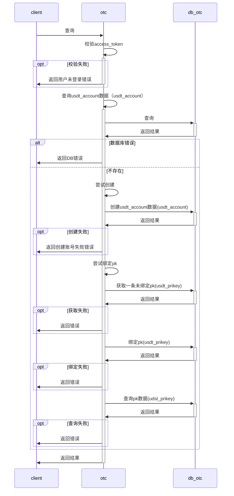

账户查询时序图

## 2 账户余额

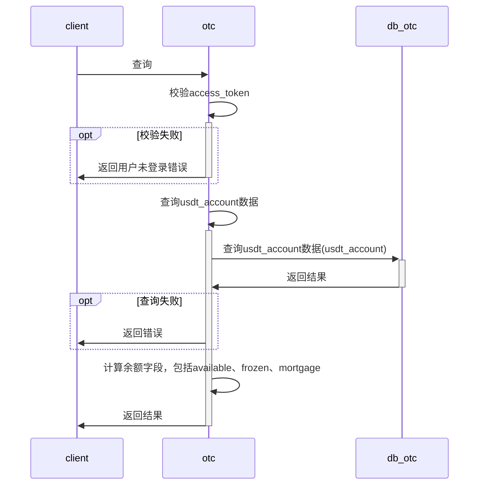

账户余额查询时序图

## 3 充值

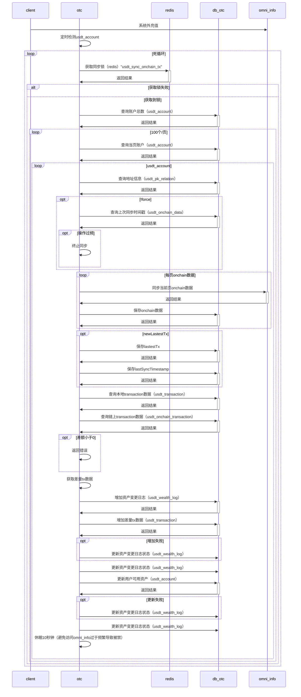

账户充值时序图

## 4 抵押

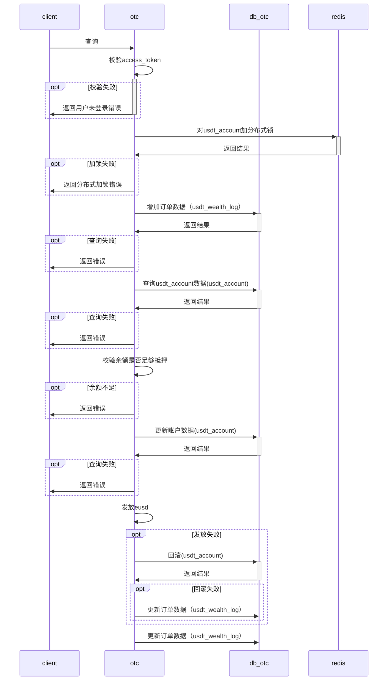

账户抵押时序图

## 5 赎回

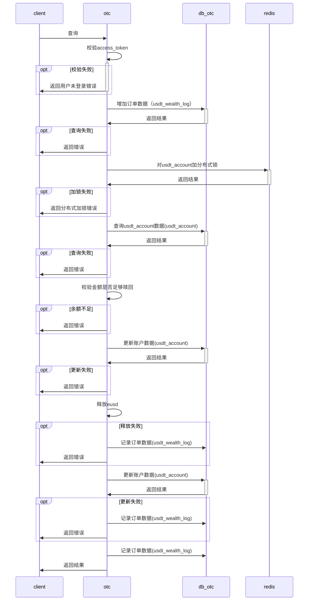

账户赎回时序图

## 6 提现

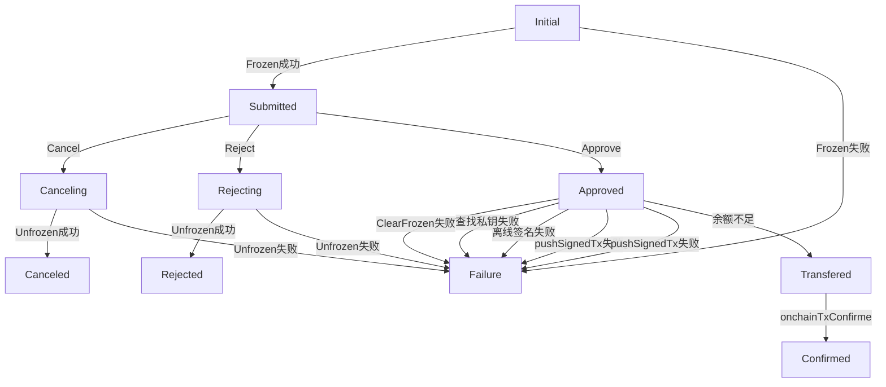

转账状态图

### 6.1 提现申请

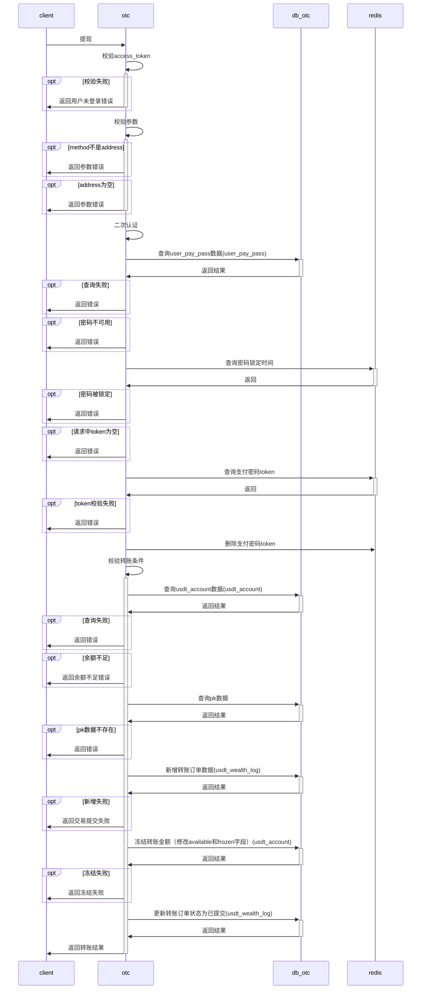

提现申请时序图

### 6.2 拒绝提现

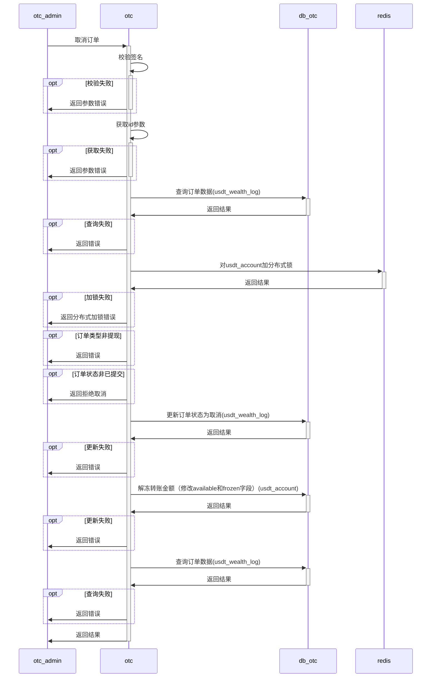

### 6.3 批准申请单

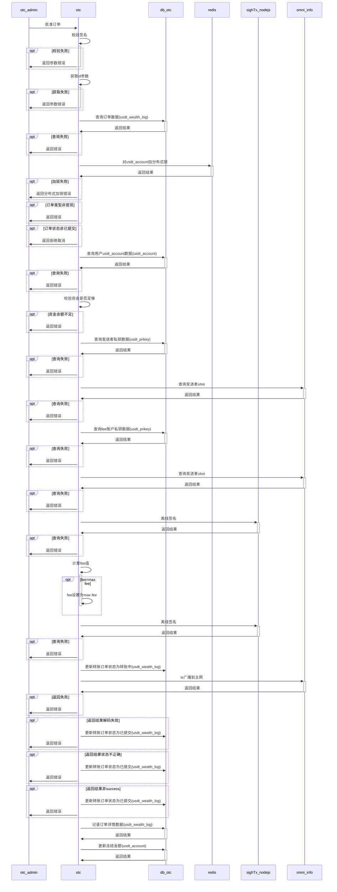

## 7 查询

## 8 提现记录查询

## 9 抵押赎回记录查询

## 10 归集

| 目的 | 描述 | 备注 |
| ---- | ---- | ---- |
|   安全性   |   在用户钱包密钥丢失的情况下，最小化资产损失   |      |
| 操作性 | 对用户资产的统一调配管理 | |
| 可用性 | 平台内的账户转账，直接走数值修改，不走链上操作，节约转账手续费成本，同时提高效率 | |

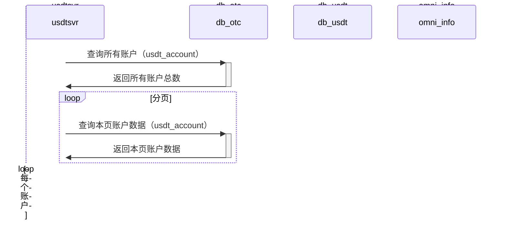

## 11 密钥管理

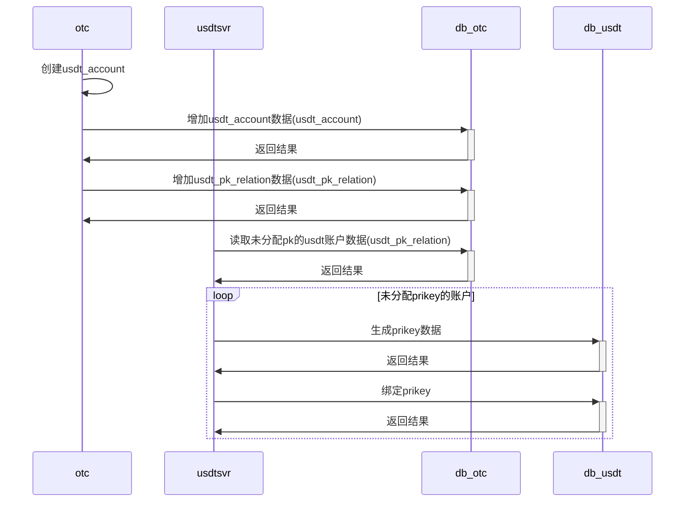
