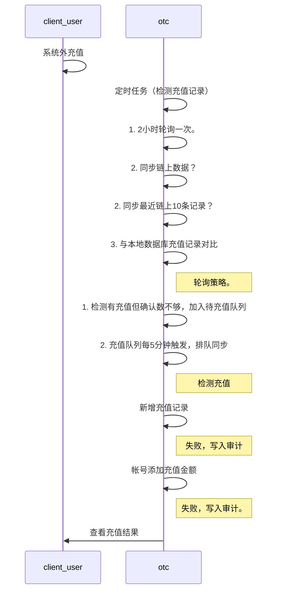
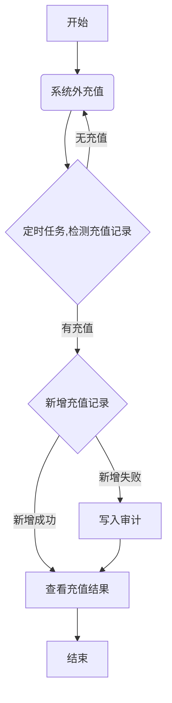

# usdt充值流程

## 1 usdt充值

#### 1.1 系统检测充值时序图

```mermaid
sequenceDiagram
    participant client_user
    participant otc
    client_user->>client_user:系统外充值
    otc->>otc:定时任务（检测充值记录）
    otc->>otc:1. 2小时轮询一次。
    otc->>otc:2. 同步链上数据？
    otc->>otc:2. 同步最近链上10条记录？
    otc->>otc:3. 与本地数据库充值记录对比
    Note right of otc:轮询策略。
    otc->>otc:1. 检测有充值但确认数不够，加入待充值队列
    otc->>otc:2. 充值队列每5分钟触发，排队同步
    Note right of otc: 检测充值
    otc->>otc:新增充值记录
	Note right of otc: 失败，写入审计
    otc->>otc:帐号添加充值金额
    Note right of otc: 失败，写入审计。
    otc->>client_user:查看充值结果
```

usdt充值时序图

#### 1.2 系统检测充值流程图

```mermaid
graph TD
    A[开始]--> B(系统外充值)
    B --> C{定时任务,检测充值记录}
    C -->|有充值| D{新增充值记录}
    C -->|无充值| B
    D -->|新增成功| G[查看充值结果]
    D -->|新增失败| F[写入审计]
    F --> G
    G --> H[结束]
```

USDT充值流程图
