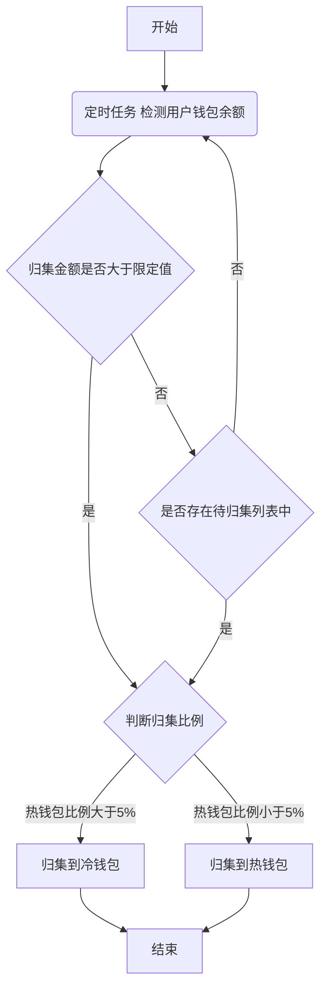
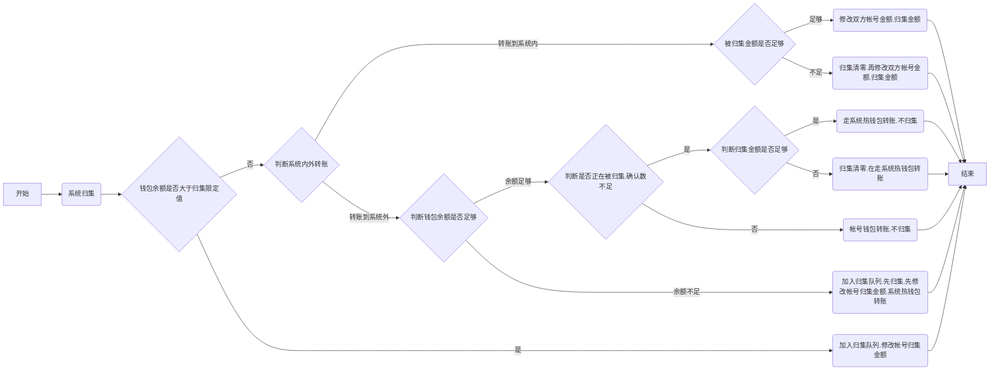

# usdt归集流程

## 1 usdt抵押赎回

#### 1.1 usdt归集主流程图

usdt归集主流程图

#### 1.2 usdt归集流程图

usdt归集流程图

## 附：
1. 钱包余额 = 帐号可用金额 + 冻结金额 + 抵押金额 - 被系统归集金额 - 帐号转出金额(包括系统内，系统外转账)
2. 转账申请总金额 = 冻结金额
3. 发起提现申请时可提现金额 <= 帐号可用金额
4. 提现审批时可转账金额 <= 帐号被冻结的金额

