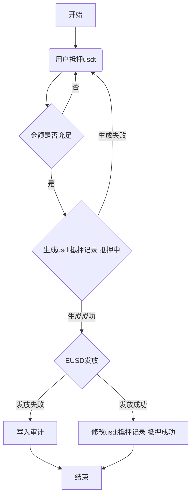
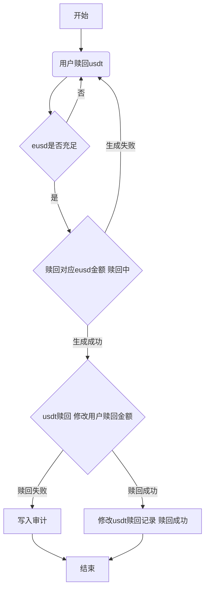

# usdt抵押赎回流程

## 1 usdt抵押赎回

#### 1.1 usdt抵押流程图

```mermaid
graph TD
    A[开始]--> B(用户抵押usdt)
    B --> C{金额是否充足}
    C -->|是| D{生成usdt抵押记录 抵押中}
    C -->|否| B
    D -->|生成成功| F{EUSD发放}
    D -->|生成失败| B
    F -->|发放成功| G[修改usdt抵押记录 抵押成功]
    F -->|发放失败| H[写入审计]
    H --> I[结束]
    G --> I[结束]
```

usdt抵押流程图

#### 1.2 usdt赎回流程图

```mermaid
graph TD
    A[开始]--> B(用户赎回usdt)
    B --> C{eusd是否充足}
    C -->|是| D{赎回对应eusd金额 赎回中}
    C -->|否| B
    D -->|生成成功| F{usdt赎回 修改用户赎回金额}
    D -->|生成失败| B
    F -->|赎回成功| G[修改usdt赎回记录 赎回成功]
    F -->|赎回失败| H[写入审计]
    H --> I[结束]
    G --> I[结束]
```

usdt赎回流程图
