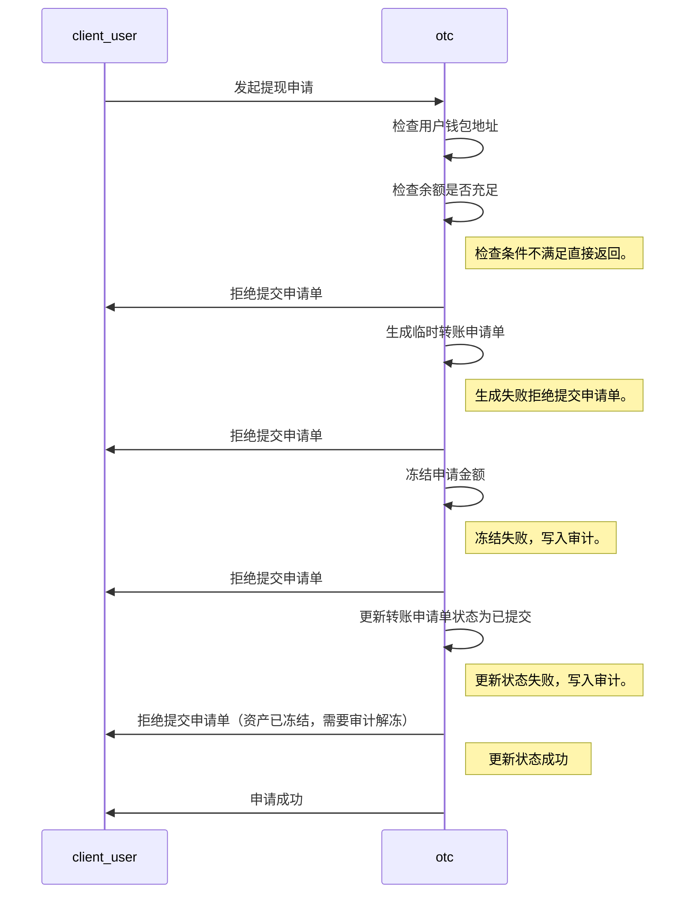
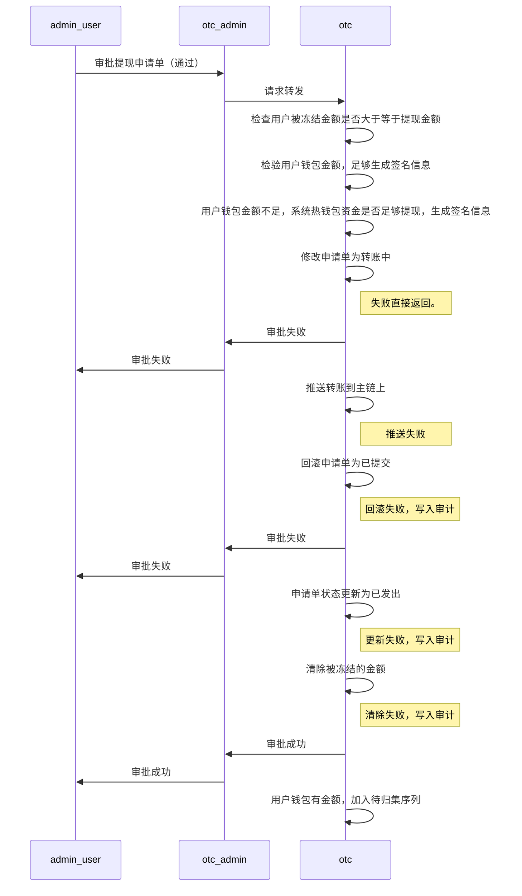
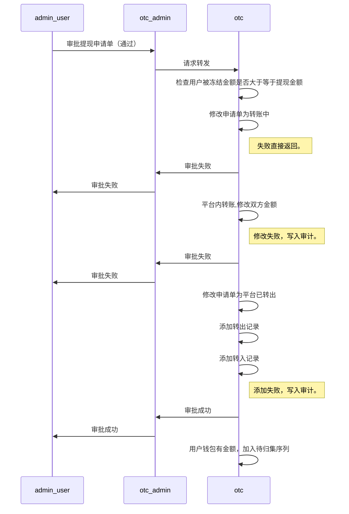
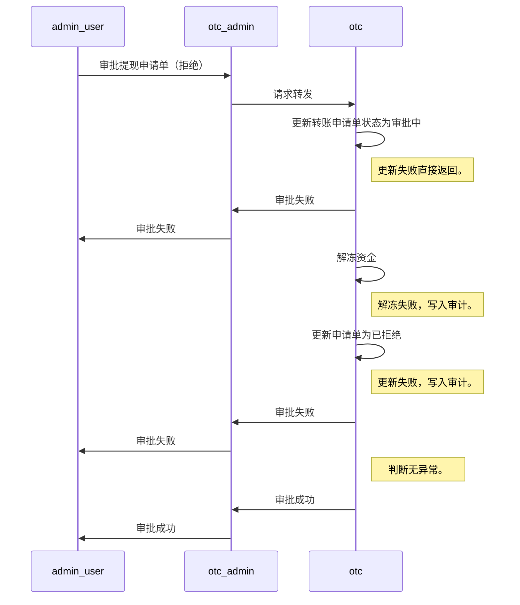

# usdt提现流程

## 1 usdt提现申请单

#### 1.1 发起usdt提现申请单

提现申请时序图

## 2 usdt提现审批

#### 2.1 审批通过（链上转帐）

usdt审批通过时序图

#### 2.2 审批通过（系统内转账）

usdt审批通过时序图

#### 2.3 审批拒绝

usdt审批拒绝时序图

## 附：

#### status 抵押赎回状态定义：

| 类型        | 描述     |
| ----------- | ------- |
| 1           | 转入（充值） |
| 2           | 转出（提现） |
| 3           | 抵押    |
| 4           | 赎回    |

#### status 抵押赎回状态定义：

| 状态       | 描述    |
| ---------- | ------- |
| 1          | 抵押中 |
| 2          | 已抵押   |
| 3          | 赎回中   |
| 4          | 已赎回   |

#### status 充值状态定义：

| 状态       | 描述    |
| ---------- | ------- |
| 100        | 状态未知 |
| 101        | 待确认   |
| 102        | 确认中   |
| 103        | 已确认   |
| 104        | 已完成   |

#### status 提现状态定义：

| 状态            | 描述        |
| --------------- | ---------- |
| 201             | 状态未知    |
| 202             | 已提交      |
| 203             | 审核中      |
| 204             | 已取消      |
| 205             | 审批通过    |
| 206             | 审批拒绝    |
| 207             | 处理中      |
| 208             | 已汇出      |
| 209             | 区块已确认   |
| 210             | 区块交易错误 |
| 211             | 已撤销      |

