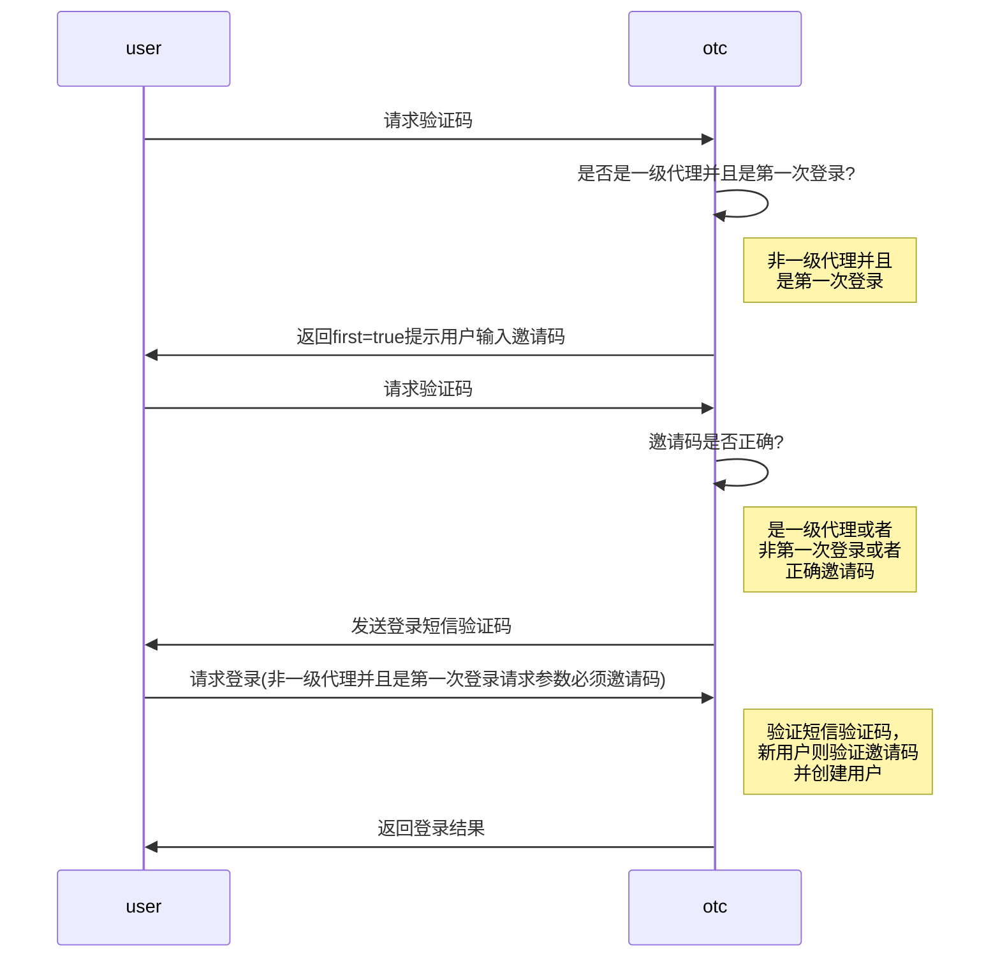

# otc用户登录

```mermaid
sequenceDiagram
   	participant user
    participant otc
   	user->>otc: 请求验证码
   	otc->>otc:是否是一级代理并且是第一次登录?	
   	Note right of otc: 非一级代理并且<br>是第一次登录
   	otc->>user: 返回first=true提示用户输入邀请码
   	user->>otc: 请求验证码
   	otc->>otc:邀请码是否正确?
   	Note right of otc: 是一级代理或者<br>非第一次登录或者<br>正确邀请码
   	otc->>user: 发送登录短信验证码
   	user->>otc: 请求登录(非一级代理并且是第一次登录请求参数必须邀请码)
   	Note right of otc: 验证短信验证码，<br>新用户则验证邀请码<br>并创建用户
   	otc->>user:返回登录结果
```

用户登录时序图
