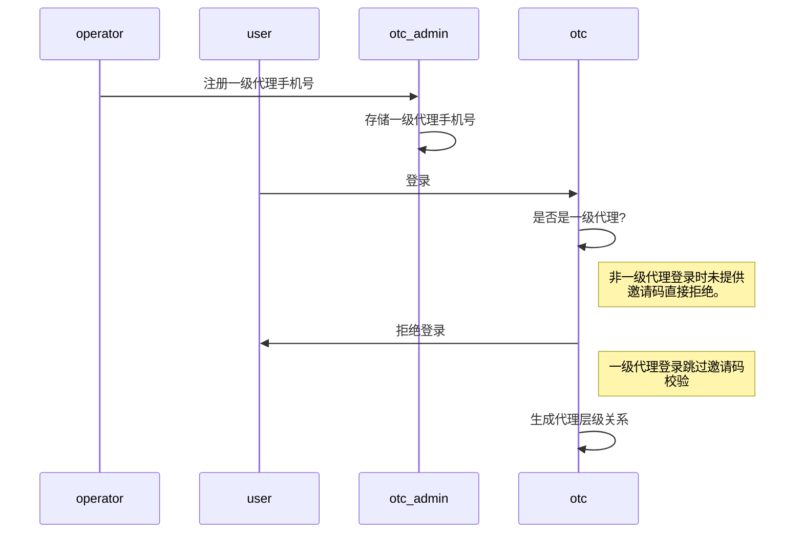
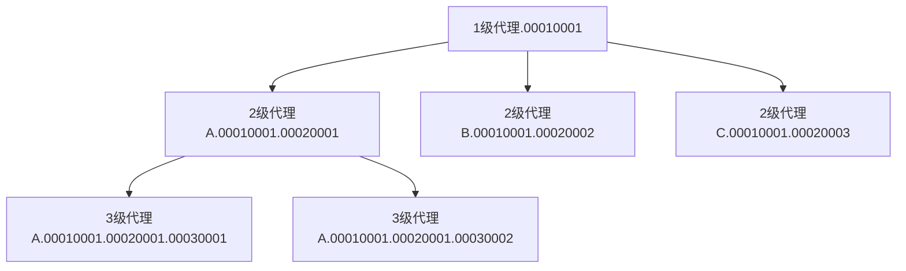
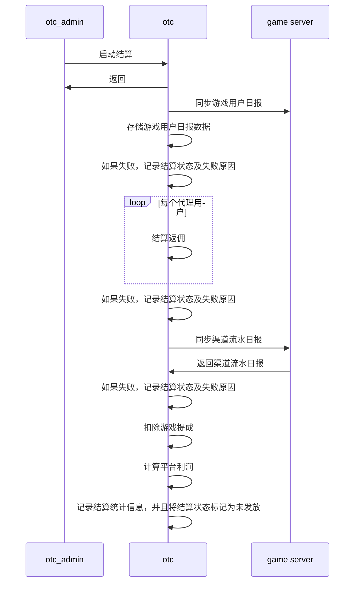
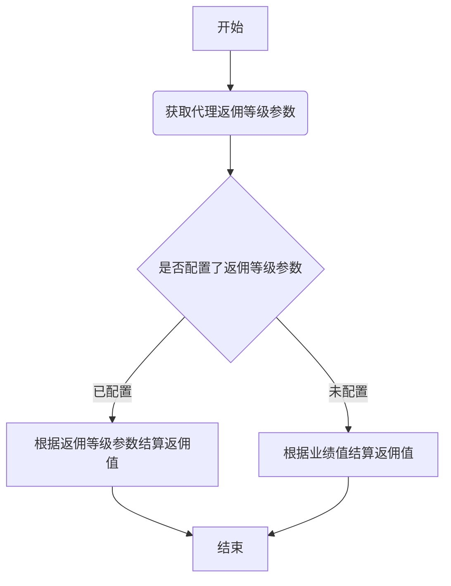
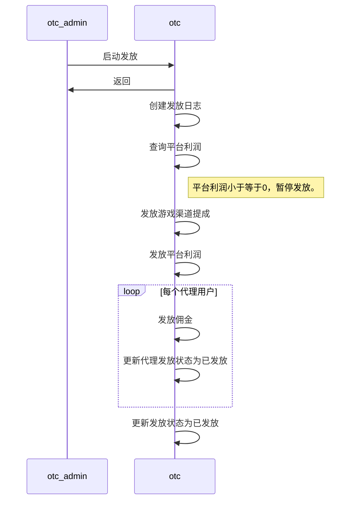

# 代理返佣模块实现

## 1 代理注册

代理注册时序图

代理层级关系树状图

### 1.1 一级代理注册

一级代理通过后台系统注册，实际上只是手机号的注册，无复杂流程。

### 1.2 N级代理注册

非一级代理用户注册时必须指定邀请码才能注册，否则会直接被拒绝。

## 2 代理佣金

### 2.1 代理佣金结算

代理佣金结算时序图

代理获取返佣指数流程图

### 2.2 代理佣金发放

代理佣金发放时序图

## 3 后台相关

### 3.1 代理列表

| 代理ID | 上级代理ID | 档位ID | 邀请码 | 邀请人数 | 累计佣金 | 可提现余额 | 更新时间 | 操作 |
| ----- | ----- | ----- | ----- | ----- | ----- | ----- | ----- | ----- |
| 169750614920658944 | 169750166759276544 | 0 | WWMB43 | 0 | 0.0000 | 0.0000 | 2019-04-14 18:08:20 | <删除> |

### 3.2 一级代理

| 手机号 | 状态 | 更新时间 | 操作 |
| ----- | ----- | ----- | ----- |
| 18665876646 | 已注册 | 2019-04-14 18:06:22 | <删除> |

### 3.3 档位列表

| 档位ID | 档位名称 | 佣金（元/万） | 更新时间 | 操作 |
| ----- | ----- | ----- | ----- | ----- |
| 1 | 黄金 | 120 | 2019-04-14 18:16:26 | <详情> <编辑> <删除> |

### 3.4 佣金等级

| 业绩开始金额(万) | 业绩结束金额(万) | 每万业绩佣金(元/万) | 操作 |
| ----- | ----- | ----- | ----- |
| 0 | 10 | 50 | <删除> |

### 3.5 佣金统计

| 日期 | 税收 | 渠道 | 佣金 | 利润 | 发放状态 | 操作 |
| ----- | ----- | ----- | ----- | ----- | ----- |
| 2019-04-14 | 63423.0000 | 1034.2250 | 336.0000 | 8972.0250 | 未发放 | <结算佣金> <发放佣金> |
