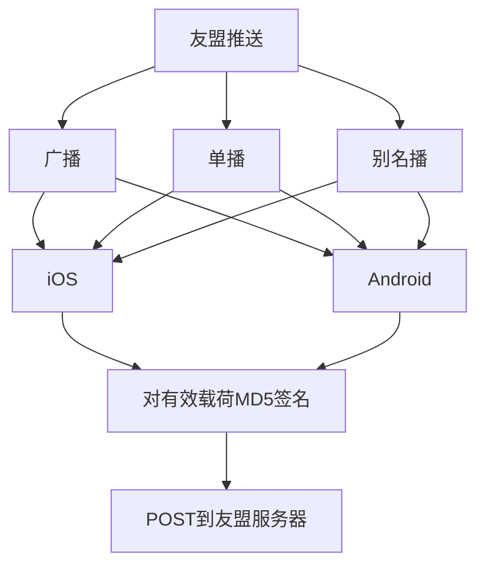

**umeng推送的本质，就是构造请求**  
参考文档:
https://dev.umeng.com/sdk_integate/android_push_apidoc#1

详细流程



**友盟推送，还提供取消推送，获取推送状态等接口，未来可以集成以监控整个推送流程;**  

**推送参数中提供 静默推送，icon定制，是否闪灯，是否震动等个性化参数，未来有需要可以集成;**  
  
  
**1.在otc业务中加入推送(林昕提供)**
```
承兑商-消息通知

充值USDT

『承兑商用户名』，您的USDT资产账户已收到『116000』个USDT，请注意查收。

抵押

『承兑商用户名』，您抵押的『116000』个USDT已兑换成EUSD。

赎回

『承兑商用户名』，您已赎回『116000』个USDT。

转账

『承兑商用户名』，您的USDT资产账户已于『2019-04-11 08:48:06』向『手机号或地址』转出『116000』个USDT，若非本人操作，请及时修改密码。  


收款订单-新订单

『承兑商用户名』，您有一笔新的收款订单待处理，订单号为『190410203642876』，数量为『30000』个，总价为『206700』CNY，请等待对方付款后及时查账确认。
   

收款订单-买家已付款

您订单号为『190410203642876』，数量为『30000』个，总价为『206700』CNY的订单对方已完成支付，请及时查账，确认到账后请及时放币，若未收到款项，可申请客诉处理。  


支付订单-新订单

『承兑商用户名』，您有一笔新的支付订单待处理，订单号为『190410203642876』，数量为『30000』个，总价为『206700』CNY，请等待对方转币后及时查账确认。


支付订单-买家已转币

『玩家名』已确认收到您的订单『115523378474786』付款，系统会自动将『14.619883 』EUSD发放到您的账户，请注意查收。


订单超时-被系统取消

您的订单『115551354206259』因为超时已被系统取消。  


订单取消-被买家取消

您的「收款/支付」订单『115551354206259』已被「玩家名」取消。  


订单取消-被客服取消

您的「收款/支付」订单『115551354206259』已被客服取消。
```