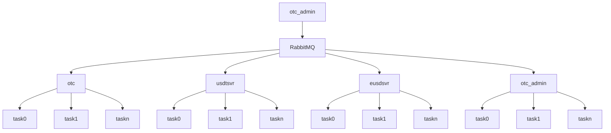
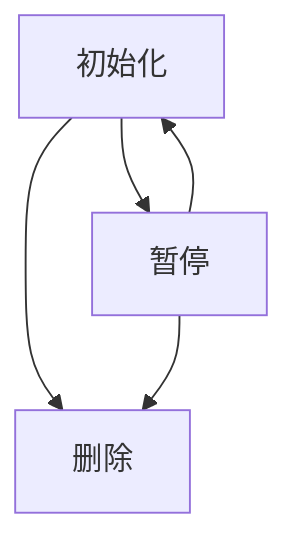
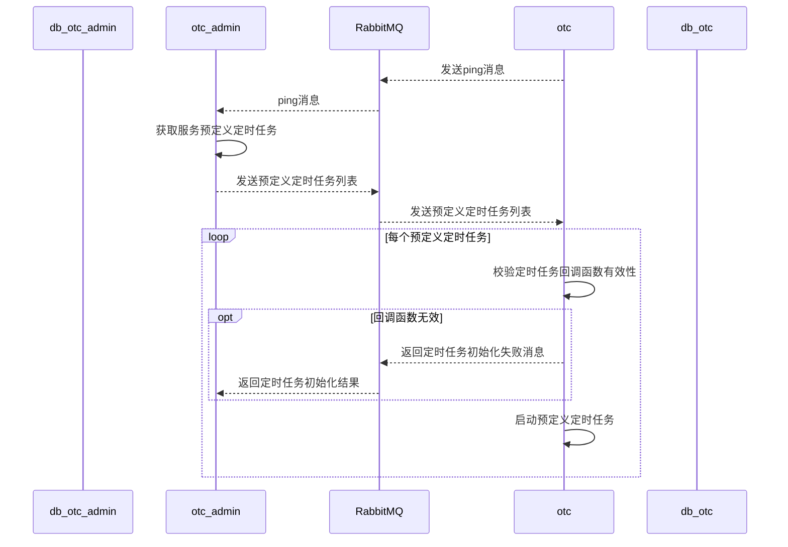
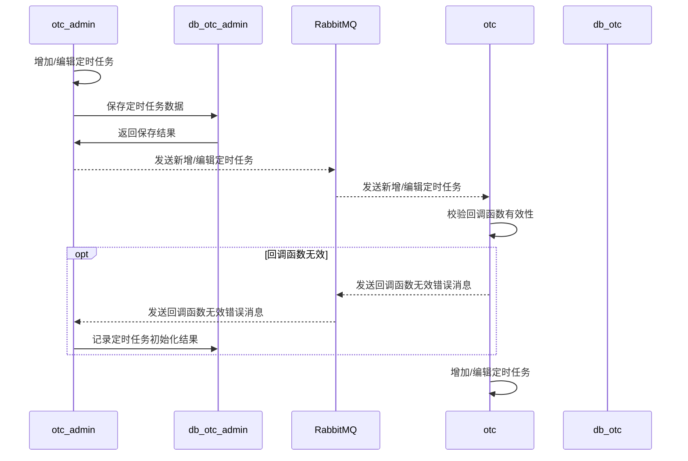
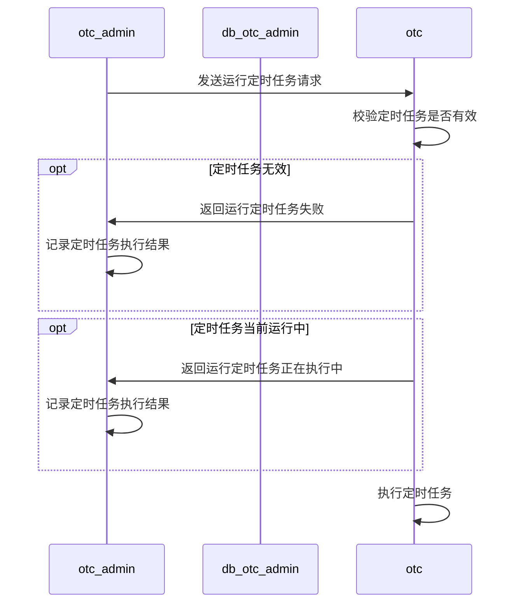
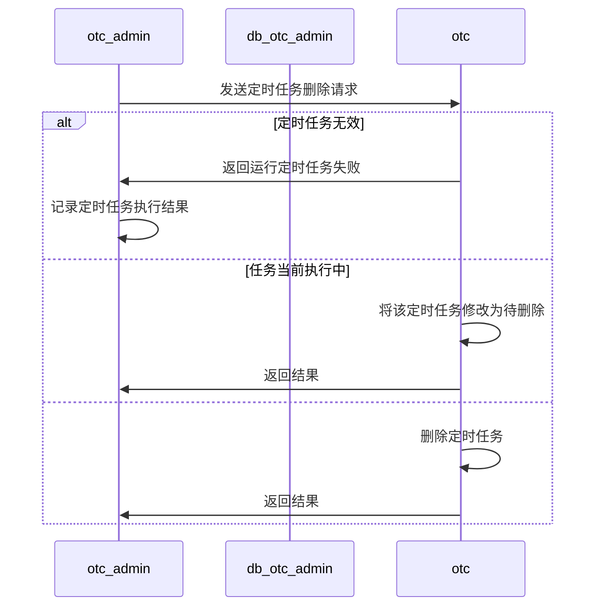
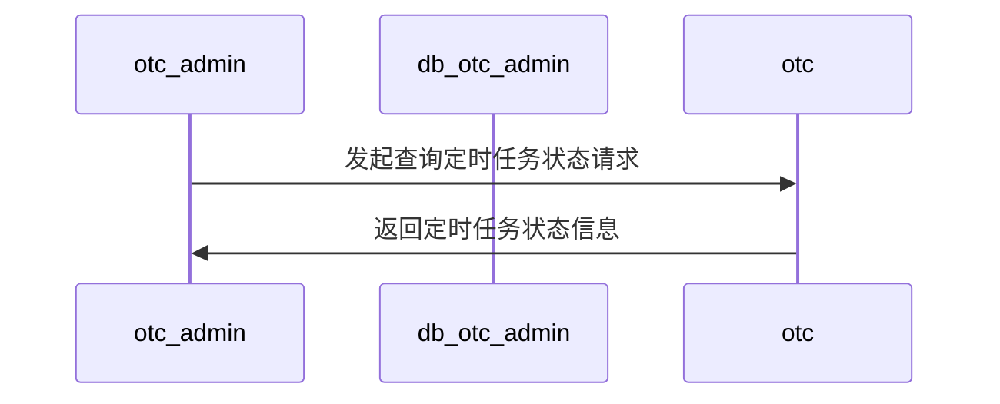
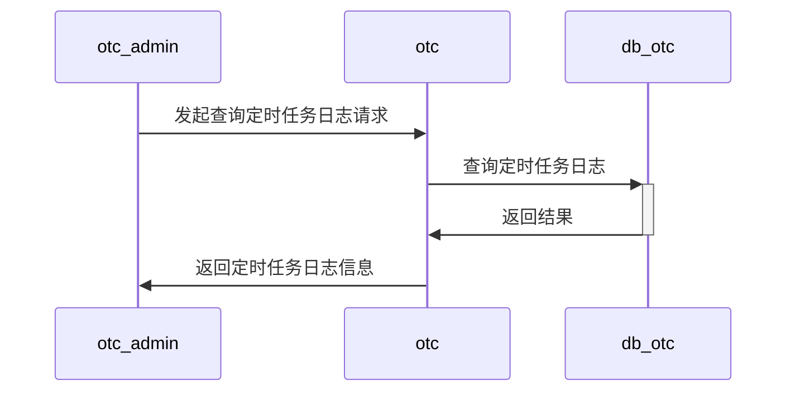
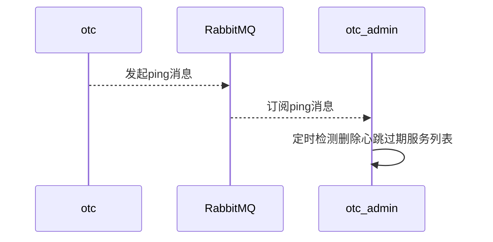

# 后台系统监控设计

## 1 定时任务管理

定时任务系统架构图

定时任务状态机

### 1.1 功能

#### 1.1.1 预定义定时任务初始化

#### 1.1.2 增加/编辑/暂停

编辑/暂停定时任务，不影响当前正在执行的业务逻辑。

#### 运行

#### 删除

#### 状态

#### 查询定时任务日志

#### 清理待删除定时任务

### 1.2 权限

## 2 请求统计

### 2.1 功能

#### 统计功能

### 2.2 权限

## 3 pprof 模块
### 3.1 功能
#### 查看服务goroutine信息
#### 查看服务heap信息
#### 查看threadcreate信息

#### 查看block信息
#### 导出cpuprof

#### 导出memprof

#### 查看gc summary信息
### 3.2 权限

## 4 服务状态监控
### 4.1 功能

#### 服务启动自动发现

### 4.2 权限

