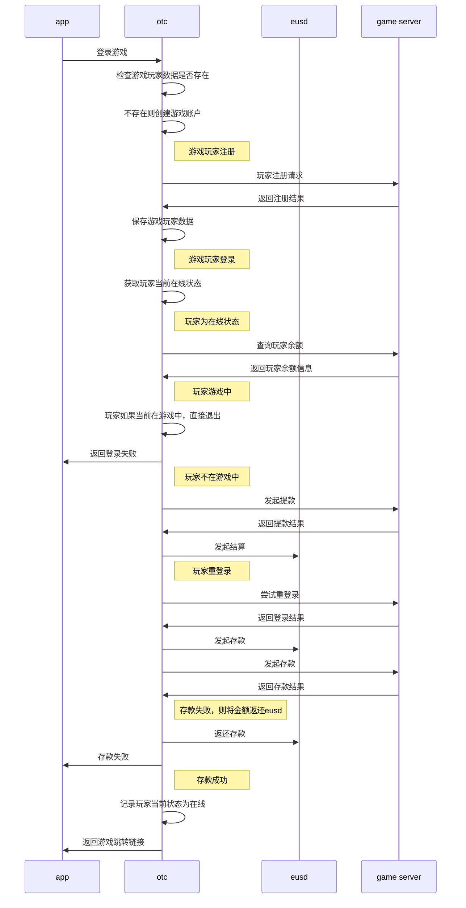
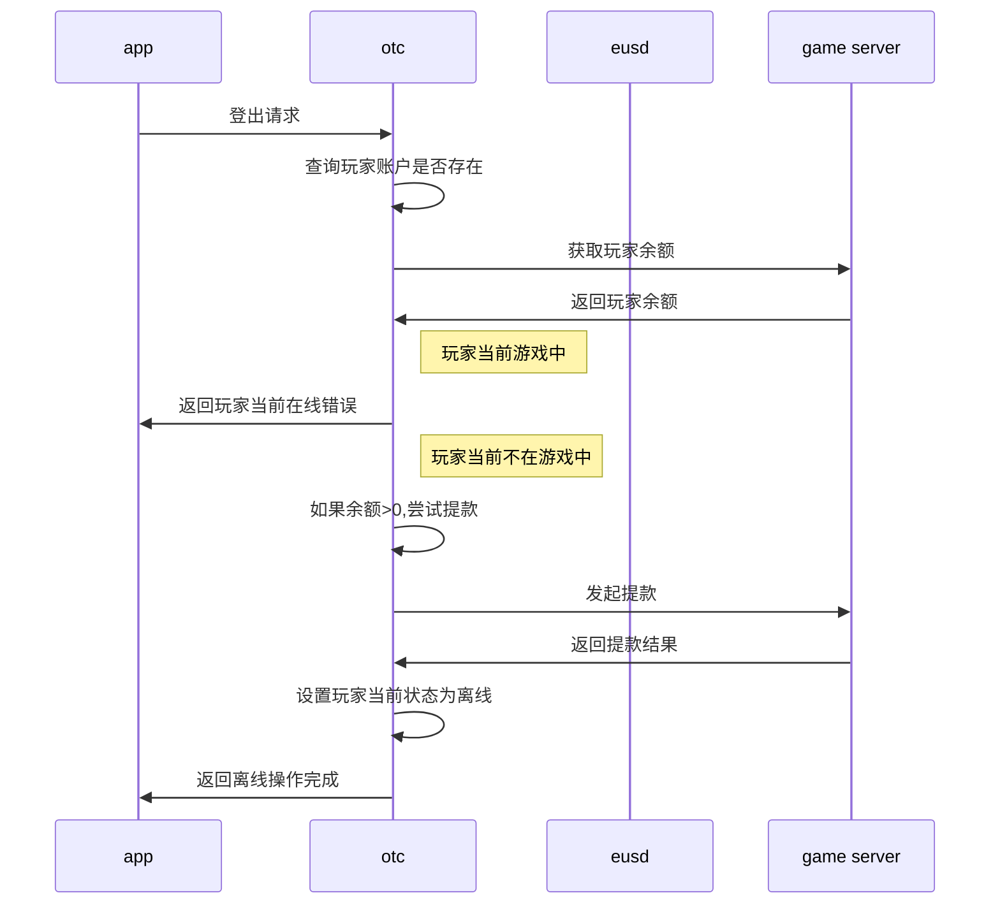
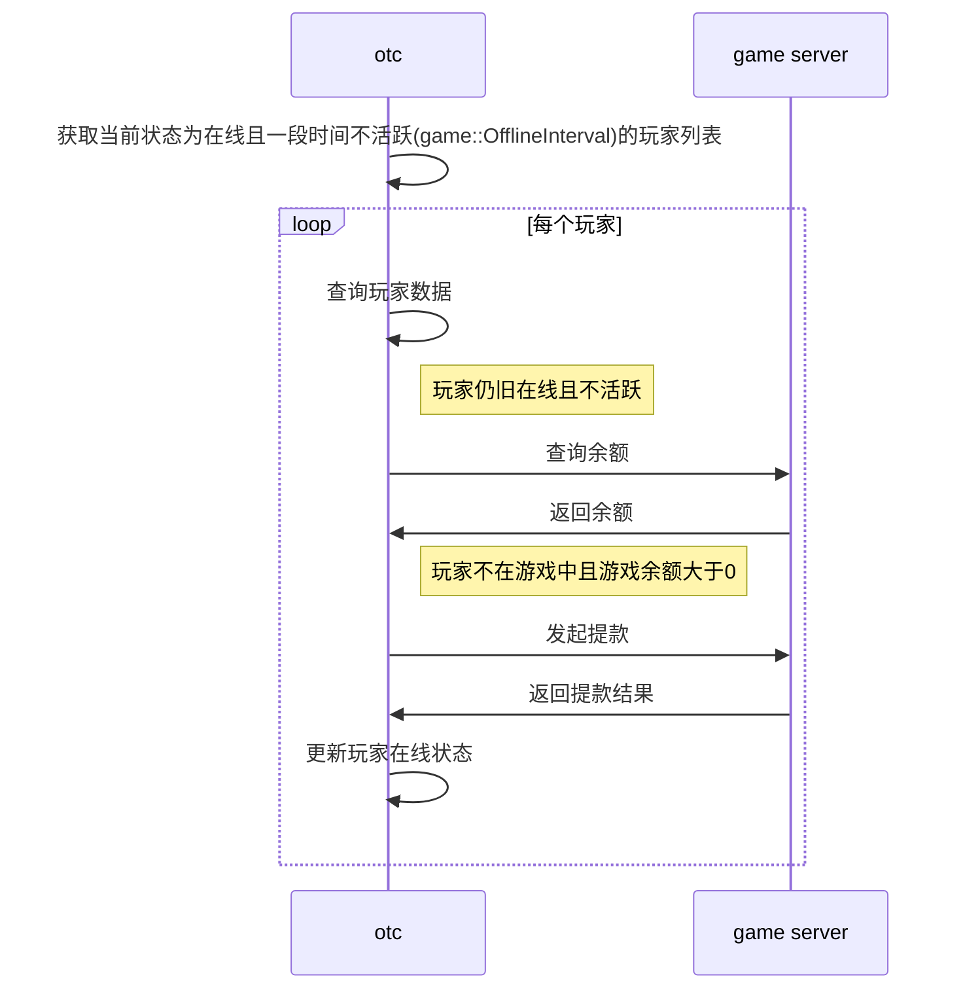

# 游戏

##  1 游戏注册/登录/登出

### 1.1 游戏注册/登录

游戏注册登录时序图

### 1.2 游戏正常登出

### 1.3 游戏异常登出

### 1.4 游戏玩家相关

| 概述  | 详述 | 备注 |
| ---- | ---- | ---- |
|玩家名称 | U<uid> | |
| 玩家昵称 | 同玩家名称 |  |
| 玩家账户密码 |注册时生成随机密码，并且通过AES对称加密方式保存在数据库中 |  |
| 玩家游戏内登出 | 玩家登录时会注册一个return_url给game server，在游戏中点击退出游戏按钮，会访问return_url，以此通知otc |  |
| 玩家异常登出 | 玩家异常退出，例如：kill app或者游戏异常，无法call return_url。通过定时检测 玩家状态，如果玩家状态 |

## 2 游戏报表

### 2.1 游戏玩家日报表

### 2.2 游戏渠道日报表