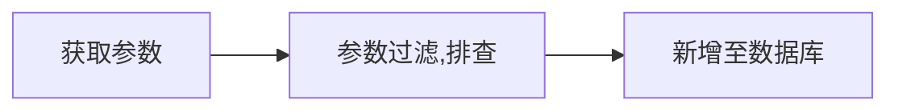

**聊天接口**  
**新增聊天记录** 

**查询聊天记录**  
1. 瀑布流获取聊天信息  
    ```mermaid
    graph LR
    获(获取id,up or down, all)-->参数过滤,排查;
    参数过滤,排查-->根据条件查询聊天记录;
    ```  

2. 通过订单id获取订单聊天记录
    ```mermaid
    graph LR
    获取消息id-->参数过滤,排查;
    参数过滤,排查-->数据库查询;
    ```