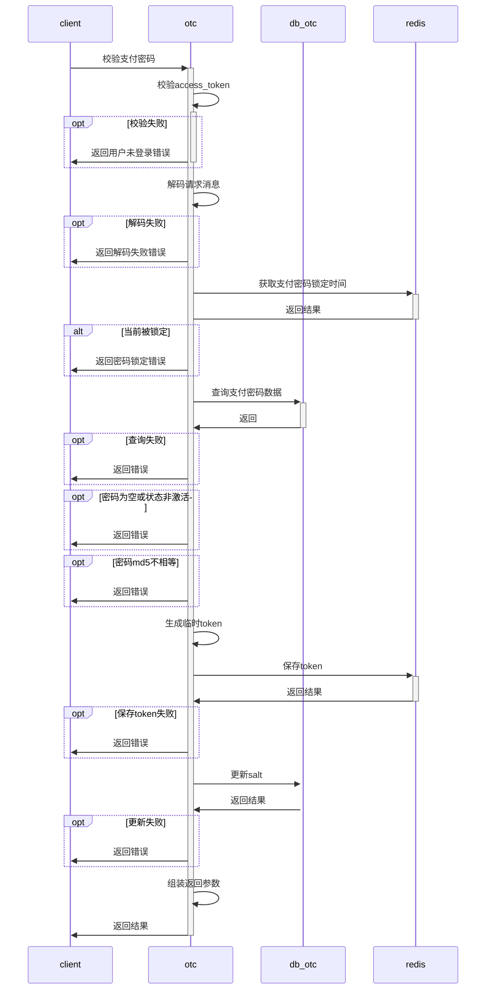
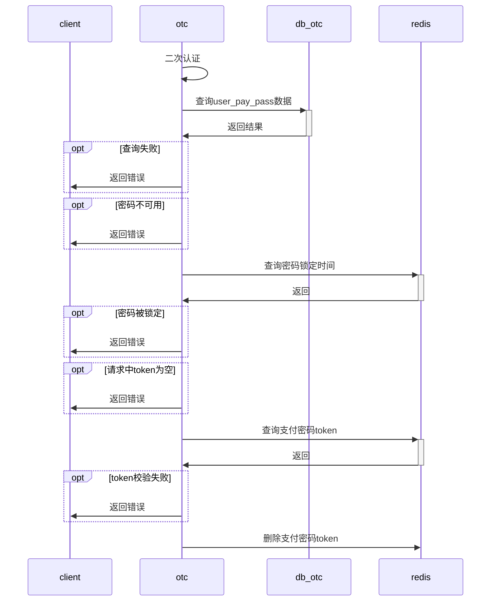
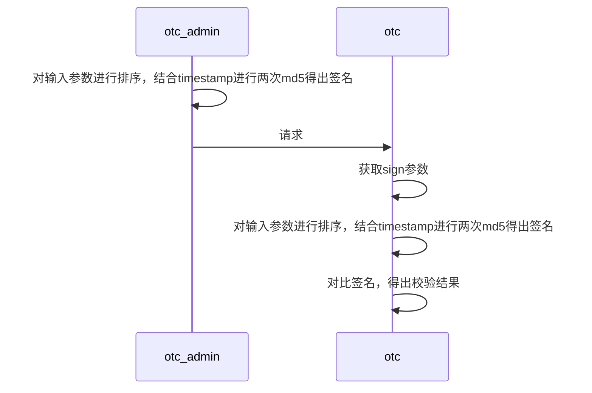

# 通用流程

## 1 二次校验

### 1.1 验证支付密码

```mermaid
sequenceDiagram
    participant client
    participant otc
    participant db_otc
    participant redis

    client->>+otc:校验支付密码
    
    %% 校验access_token
    otc->>+otc:校验access_token
    opt 校验失败
    otc->>-client:返回用户未登录错误
    end
    
    %% 解码请求消息
    otc->>otc:解码请求消息
    opt 解码失败
    otc->>client:返回解码失败错误
    end
    
    %% 校验密码是否被锁定
    otc->>+redis:获取支付密码锁定时间
    redis->-otc:返回结果
    alt 当前被锁定
    otc->>client:返回密码锁定错误
    end
    
    %% 验证支付密码，并返回token和临时sign_salt
    otc->>+db_otc:查询支付密码数据
    db_otc->>-otc:返回
    opt 查询失败
    otc->>client:返回错误
    end
    
    opt 密码为空或状态非激活
    otc->>client:返回错误
    end
    
    %% 对比密码md5
    opt 密码md5不相等
    otc->>client:返回错误
    end
    
    %% 生成临时token
    otc->>otc:生成临时token
    otc->>+redis:保存token
    redis->>-otc:返回结果
    opt 保存token失败
    otc->>client:返回错误
    end
    
    %% 重置签名的盐
    otc->>+db_otc:更新salt
    db_otc->>otc:返回结果
    opt 更新失败
    otc->>client:返回错误
    end
    
    otc->>otc:组装返回参数
    
    otc->>-client:返回结果
```

### 1.2 二次验证

```mermaid
sequenceDiagram
    participant client
    participant otc
    participant db_otc
    participant redis
    
    otc->>otc:二次认证
    
    %% 查询user_pay_pass数据
    otc->>+db_otc:查询user_pay_pass数据
    db_otc->>-otc:返回结果
    opt 查询失败
    otc->>client:返回错误
    end
    opt 密码不可用
    otc->>client:返回错误
    end
    otc->>+redis:查询密码锁定时间
    redis->>-otc:返回
    opt 密码被锁定
    otc->>client:返回错误
    end
    opt 请求中token为空
    otc->>client:返回错误
    end
    otc->>+redis:查询支付密码token
    redis->>-otc:返回
    opt token校验失败
    otc->>client:返回错误
    end
    otc->>redis:删除支付密码token
```

## 2 后台请求签名校验

```mermaid
sequenceDiagram
    participant otc_admin
    participant otc
    
    otc_admin->>otc_admin:对输入参数进行排序，结合timestamp进行两次md5得出签名
    otc_admin->>otc:请求
    otc->>otc:获取sign参数
    otc->>otc:对输入参数进行排序，结合timestamp进行两次md5得出签名
    otc->>otc:对比签名，得出校验结果
    
```

